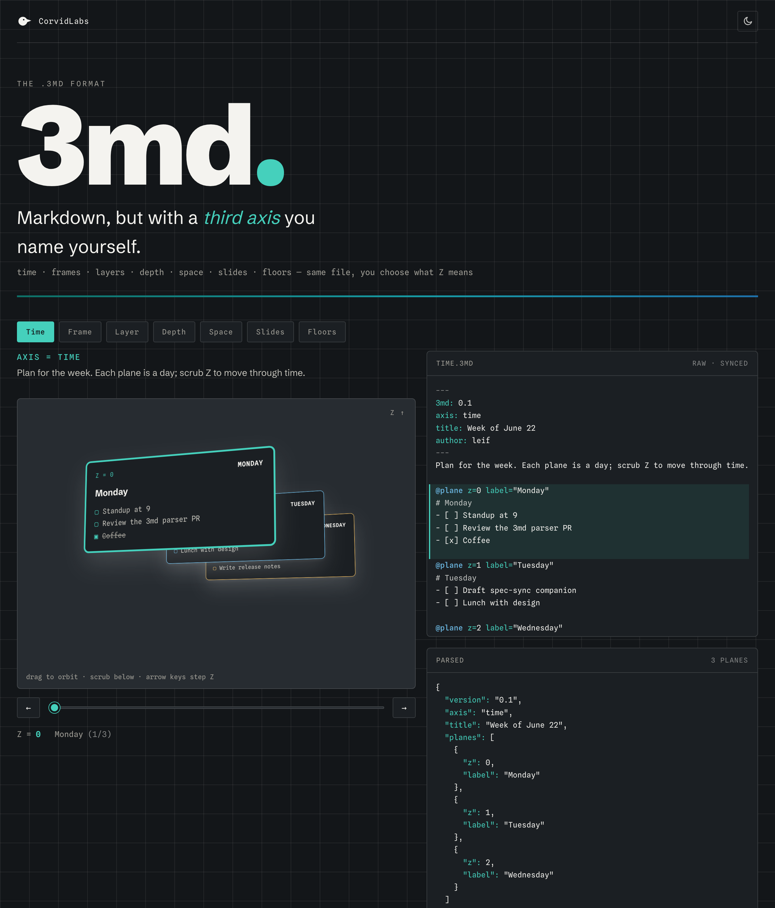

# 3md

[](https://github.com/CorvidLabs/3md/actions/workflows/trust.yml)
[](https://github.com/CorvidLabs/3md/releases)
[](LICENSE)
[](https://corvidlabs.github.io/3md/)

**Markdown with a Z axis.** A `.3md` file is ordinary Markdown extended along
one free axis: stack your content into **planes** and tell the reader what the
depth means. Time for a daily planner. Frames for an animation. Layers for
annotations. Space for a scene.

**[Try the interactive demo](https://corvidlabs.github.io/3md/)** (also on
[corvidlabs.xyz/3md](https://corvidlabs.xyz/3md/)), or
**[browse all 100 examples](https://corvidlabs.github.io/3md/gallery.html)** in the
[gallery](gallery/).

<p align="center">
  <a href="https://corvidlabs.github.io/3md/"></a>
</p>

```
---
3md: 0.1
axis: time
title: My Week
---
@plane z=0 label="Monday"
# Monday
- [ ] Standup

@plane z=1 label="Tuesday"
# Tuesday
```

This repository holds the format specification ([SPEC.md](SPEC.md)), example
documents ([Examples/](Examples)), three parsers kept in lockstep (`ThreeMD`, a
cross-platform Swift parser; a TypeScript port in [`js/`](js); and a Rust crate
in [`rust/`](rust)), and a shared cross-implementation conformance suite
([conformance/](conformance)) that all three pass.

## Why

Markdown is two dimensional. Plenty of documents are not: a planner moves
through time, an annotated contract has overlay layers, an ASCII animation is a
stack of frames. 3md keeps Markdown's plain-text simplicity and adds one axis,
with the author declaring what that axis means. Nothing comparable ships today;
the closest prior art renders existing Markdown into 3D rather than giving the
text a depth dimension of its own.

## Installation

### Swift Package Manager

Add the package to your `Package.swift`:

```swift
.package(url: "https://github.com/CorvidLabs/3md", from: "1.0.0")
```

Then depend on the `ThreeMD` library product:

```swift
.product(name: "ThreeMD", package: "3md")
```

### JavaScript / TypeScript

A faithful TypeScript port of the Swift parser is published to GitHub Packages.
All three implementations (Swift, TypeScript, and the Rust crate in [`rust/`](rust))
are kept in sync by the shared conformance suite
([conformance/](conformance)). Point the `@corvidlabs` scope at the GitHub
registry once (in a project or user `.npmrc`), then install:

```bash
echo "@corvidlabs:registry=https://npm.pkg.github.com" >> .npmrc
bun add @corvidlabs/threemd
```

```ts
import { parse, serialize } from "@corvidlabs/threemd";

const document = parse(source);
console.log(document.axis); // "time"

// Round trips back to text:
const text = serialize(document);
```

## Library usage

```swift
import ThreeMD

let document = try Parser().parse(source)
print(document.axis)          // Axis(rawValue: "time")
for plane in document.planesByZ {
    print(plane.label ?? "", plane.body)
}

// Round trips back to text:
let text = Serializer().render(document)
```

## Command-line tool

The `threemd` CLI ships with the package and self-documents (run `threemd
--help`). A path of `-` reads from standard input.

```bash
swift run threemd validate <file>   # parse a file; print "ok" or exit non-zero with the error
swift run threemd info <file>       # print version, axis, title, and each plane's position
swift run threemd html <file>       # render the document to HTML on stdout
```

## Format at a glance

- A required `---` frontmatter block declares `3md:` (the version, and the file's
  magic marker), an optional `axis:`, an optional `title:`, and free metadata.
- `@plane z=... label="..."` directives start planes; the Markdown between
  directives is the plane body.
- A plain Markdown file with a 3md header and no directives is a valid one-plane
  document.

See [SPEC.md](SPEC.md) for the full grammar and conformance rules.

## Examples

The [Examples/](Examples) directory has nine documents spanning many axis types:

- [`daily-planner.3md`](Examples/daily-planner.3md) - `axis: time`, one plane per day.
- [`animation.3md`](Examples/animation.3md) - `axis: frame`, one plane per frame.
- [`layered-notes.3md`](Examples/layered-notes.3md) - `axis: layer`, stacked overlay layers.
- [`dungeon.3md`](Examples/dungeon.3md) - `axis: space`, rooms wired with `[[z=N]]` cross-plane links.
- [`3md-in-3md.3md`](Examples/3md-in-3md.3md) - 3md explained in 3md, with a `@plane` inside a code fence.
- Plus `recipe`, `changelog`, `resume`, and `kanban`.

## Development

This repo uses the CorvidLabs trust toolchain. The single gate is:

```bash
fledge lanes run verify
```

which runs the Swift format check, build, and tests plus the Rust crate. See
[AGENTS.md](AGENTS.md) for the standing rules every contributor and agent follows.

Each implementation has its own tests (the Swift suite has 122 tests, the
TypeScript suite 76), and all three implementations run the shared 43-vector
conformance suite in [conformance/](conformance), which is the
cross-implementation contract that keeps the parsers behaving identically.

## Status

The format and spec are at version 1.0 (stable, frozen grammar). The latest
release is v1.0.0. Older `3md: 0.1` documents remain valid: the parser is
version-lenient and never rejects a document by its version string.

## License

MIT (c) CorvidLabs. See [LICENSE](LICENSE).
