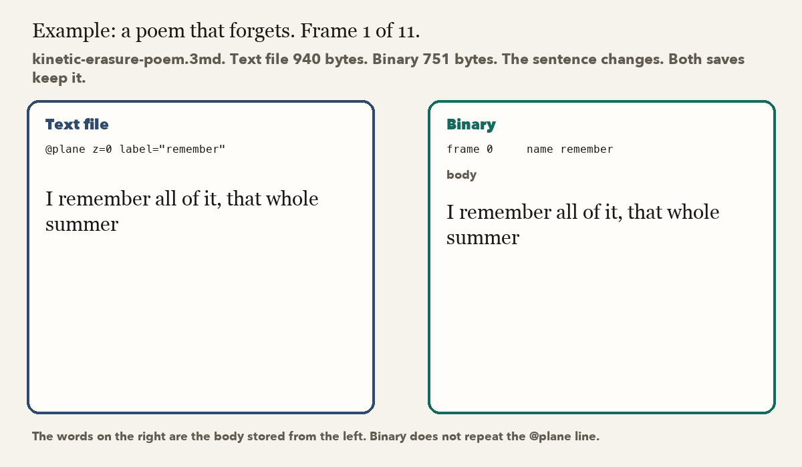
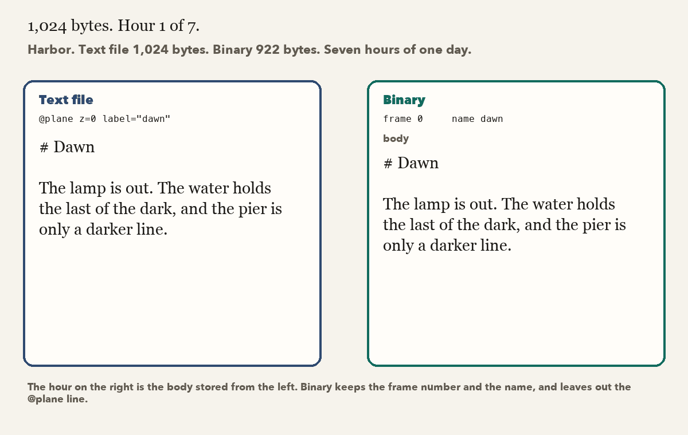
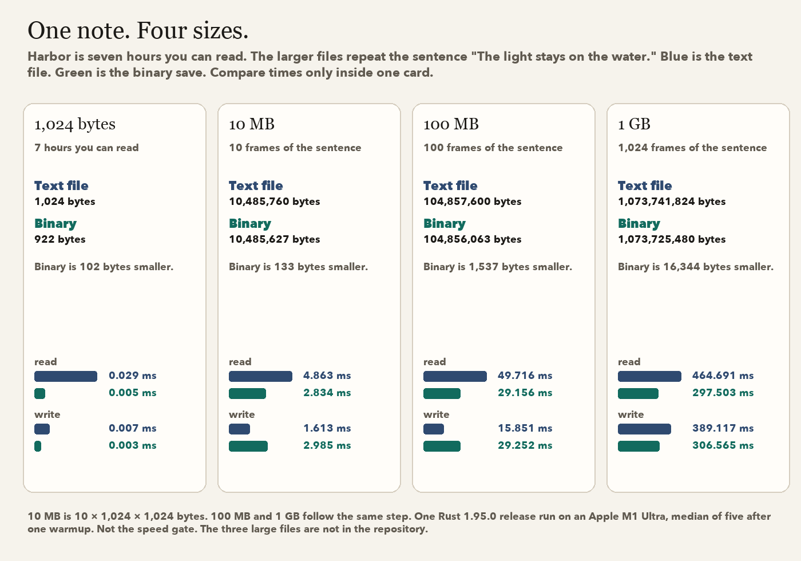
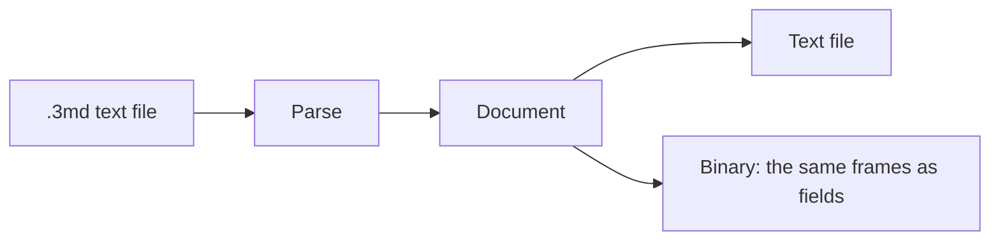
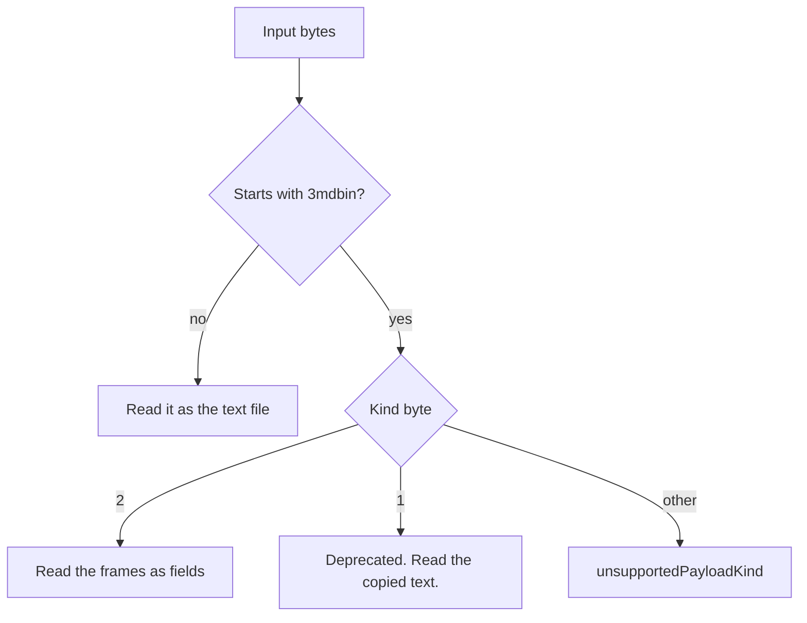

# 3md

[](https://github.com/CorvidLabs/3md/actions/workflows/trust.yml)
[](https://corvidlabs.github.io/3md/)
[](https://github.com/CorvidLabs/3md/releases)
[](LICENSE)
[](https://corvidlabs.github.io/3md/)

**Markdown with a Z axis.** A `.3md` file is ordinary Markdown extended along
one free axis: stack your content into **planes** and tell the reader what the
depth means. Time for a daily planner. Frames for an animation. Layers for
annotations. Space for a scene.

ThreeMD 2.1.0 is the current library. The text file is the `.3md` you edit.
Binary stores those same frames as fields (`.binary`, payload kind 2). Kind 1
is deprecated. A file is parsed and saved at whatever size the process can
hold. Linked file composition from 2.0.0 remains. See
[Text file and binary](#text-file-and-binary), the
[2.1.0 release notes](docs/RELEASE-2.1.0.md), and
[linked file composition](docs/FILE-COMPOSITION.md).

## Sculpt.3md

Sculpt.3md is the Mac app in this repository, at [apps/sculpt](apps/sculpt).
It paints a volume as translucent cubes or ASCII. Its package name stays Rook,
and it builds against the ThreeMD library in this checkout. Default saves stay
the app's compact `.3mdb`. That compact file is not the upstream ThreeMD binary
standard. Readable `.3md`, and uncompressed ThreeMD binary, are explicit
exports. The root package stays the cross-platform format library: Swift,
TypeScript, and Rust.

**[Try the interactive demo](https://corvidlabs.github.io/3md/)** (also on
[corvidlabs.xyz/3md](https://corvidlabs.xyz/3md/)), open the
**[viewer &amp; editor](https://corvidlabs.github.io/3md/viewer.html)** (paste any
`.3md` and share a link), read the
**[docs](https://corvidlabs.github.io/3md/docs.html)**, or
**[browse the curated animated gallery](https://corvidlabs.github.io/3md/gallery.html)**,
or flip through the
**[animated deck](https://corvidlabs.github.io/3md/viewer.html?src=examples-gallery.3md)**
where the strongest examples appear as motion cards.

This repo eats its own dog food: every doc here is also combined into one
[`docs.3md`](docs.3md) (each Markdown file is a plane). GitHub can't preview
`.3md` natively, so **[open all the docs in the 3md viewer](https://corvidlabs.github.io/3md/viewer.html?src=docs.3md)**
and scrub through them.

<p align="center">
  <a href="https://corvidlabs.github.io/3md/"></a>
</p>

[Text file and binary](#text-file-and-binary) is the bouncing dot: four frames,
saved as the `.3md` you edit and as the binary file `.binary` writes.
Kind 1 is deprecated. A file is parsed and saved at whatever size the process can hold.

```
---
3md: 0.1
axis: time
title: My Week
---
@plane z=0 label="Monday"
# Monday
- [ ] Standup

@plane z=1 label="Tuesday"
# Tuesday
```

This repository holds the format specification ([SPEC.md](SPEC.md)), example
documents ([Examples/](Examples)), and four libraries checked against one
conformance suite ([conformance/](conformance)): `ThreeMD`, a cross-platform
Swift parser; a TypeScript port in [`js/`](js); a Rust crate in [`rust/`](rust);
and a Godot 4 addon in [`gdscript/`](gdscript).

ThreeMD 2.0.0 adds general `.3mdb` storage, self-contained document
composition, linked file composition, stable optional identities, atomic
revision-checked edits and structured diagnostics in Swift, TypeScript and Rust.
The uncompressed container and shared extension fixtures are portable. LZFSE is
available only through Swift's conditional Apple backend; the ports return an
explicit unsupported-backend error. These library APIs perform no file or
network I/O. See the [release notes and migration guide](docs/RELEASE-2.0.0.md)
and [editing capability matrix](docs/EDITING-RELEASE.md).

Cross-language file interchange is verified by a development gate: each Swift,
TypeScript and Rust writer feeds every reader, for all nine pairings. It checks
canonical text, uncompressed binary, composition references, linked-file bundles
and imported edits. The [interchange catalog](conformance/interchange/README.md) states the cases,
exact-byte checks and platform exceptions. This does not claim portable LZFSE
or a shared JSON snapshot/patch transport.

The Godot addon reads and writes the same text, payload kind 1, and payload kind 2
documents. It also builds composition profiles, resolves linked files from bytes
the caller supplies, and applies revision-checked document edits. LZFSE is
refused. Parser, storage, composition, and editing scripts do not open files.
`ThreeMDFiles` reads project paths a game has already chosen. Copy
[`gdscript/addons/threemd`](gdscript/addons/threemd) into a project's `addons`
folder and enable the plugin. On Godot 4.7 the plugin imports `.3md` and
`.3mdb` as `ThreeMDDocumentAsset` resources and does not change the open scene.
Planes stay data. [`gdscript/examples`](gdscript/examples) walks layers, a linked
grove, both payload kinds, composition, edits, and a node map. Run
`fledge run gdscript` for the headless suite. That suite is local. The verify
lane above stays on the nine Swift, TypeScript, and Rust pairs until hosted CI
installs Godot. With Godot 4 on `PATH`, `fledge run gdscript-interchange` adds
the GDScript adapter and checks all sixteen writer/reader pairs.

## Why

Markdown is two dimensional. Plenty of documents are not: a planner moves
through time, an annotated contract has overlay layers, an ASCII animation is a
stack of frames. 3md keeps Markdown's plain-text simplicity and adds one axis,
with the author declaring what that axis means. Nothing comparable ships today;
the closest prior art renders existing Markdown into 3D rather than giving the
text a depth dimension of its own.

## Text file and binary

Two saves of one document. The pictures in this section are the same frames both ways.

The **text file** is the `.3md` you edit. It is ordinary UTF-8. A frame is an `@plane` line plus that frame's Markdown. Open it in any editor.

**Binary** is that same document stored as fields. `.binary` writes it. Each frame keeps its number, its name, and its body, and the `@plane` line is not written again. The file begins with 40 bytes, `3mdbin` and a short header, then the fields. This is payload kind 2.

**Kind 1 is deprecated.** It was the ThreeMD 2.0 binary file: the text file copied after that same 40-byte header. The frames are not stored as fields. Readers still open old kind 1 files. `encodeTextContainer` still writes one when a 2.0 reader must open the file. New files use `.binary`. The charts leave kind 1 out.

<p align="center">
  
</p>

[Examples/animation.3md](Examples/animation.3md) is the bouncing dot. It crosses a dotted field, left to right, then back. The text file is 579 bytes. The binary file is 516 bytes, because the `@plane` lines are left out.

<p align="center">
  
</p>

The moving picture steps through the four frames. Left is the text file. Right is the binary save of that same frame.

<p align="center">
  
</p>

The second picture is two more files from [Examples/](Examples/). The poem drops one word at a time, then builds a shorter sentence back. Text file 940 bytes, binary 751. The week planner is seven days, Monday through Sunday: text file 797 bytes, binary 685. The words on the right are the body stored from the left.

### One note at four sizes

[Harbor](docs/readme/harbor.3md) is a day at the water: seven hours, and the text file is exactly 1,024 bytes. Binary of that same day is 922 bytes. The picture plays those seven hours, then the same kind of note at 10 MB, 100 MB, and 1 GB.

10 MB means 10 × 1,024 × 1,024 bytes. 100 MB and 1 GB are the next two steps, so 1 GB is 1,073,741,824 bytes, which is 1,048,576 times the harbor day. The three large files are not in the repository. Each of their frames starts with `# Harbor` and `The light stays on the water.`, and that sentence repeats until the text file is the exact size.

<p align="center">
  
</p>

<p align="center">
  
</p>

| Text file | What it is | Text bytes | Binary bytes | Text read | Binary read | Text write | Binary write |
| --- | --- | ---: | ---: | ---: | ---: | ---: | ---: |
| 1,024 bytes | Harbor, seven hours | 1,024 | 922 | 0.029 ms | 0.005 ms | 0.007 ms | 0.003 ms |
| 10 MB | 10 frames of the sentence | 10,485,760 | 10,485,627 | 4.863 ms | 2.834 ms | 1.613 ms | 2.985 ms |
| 100 MB | 100 frames of the sentence | 104,857,600 | 104,856,063 | 49.716 ms | 29.156 ms | 15.851 ms | 29.252 ms |
| 1 GB | 1,024 frames of the sentence | 1,073,741,824 | 1,073,725,480 | 464.691 ms | 297.503 ms | 389.117 ms | 306.565 ms |

One Rust 1.95.0 release process on an Apple M1 Ultra (macOS 26.5.2, 64 GB). Each time is the median of five calls after one warmup. This is not the speed gate. At 1,024 bytes the times are a few hundredths of a millisecond. At 1 GB, reading the text took 464.691 ms and reading the binary took 297.503 ms. Writing the text took 389.117 ms and writing the binary took 306.565 ms.

In this run, reading the binary was quicker at every size. Writing the binary was quicker for the 1,024-byte day and for the 1 GB file. At 10 MB and 100 MB, writing the text was quicker. Binary is 102 bytes smaller at 1,024 bytes, 133 bytes smaller at 10 MB, 1,537 bytes smaller at 100 MB, and 16,344 bytes smaller at 1 GB. A large frame is almost all that repeated sentence, so the two files end up nearly the same size. Both are parsed and saved.

The bars inside one card compare only with each other. A long blue bar means that card's slower time, not a bigger file. The 1 GB harbor file is 1,024 long frames. It is not the cube of short lines further down, and a long line is quicker to read than a million short ones.


```mermaid
flowchart LR
  source[".3md text file"] --> parsed[Parse]
  parsed --> document[Document]
  document --> textOut["Text file"]
  document --> binary["Binary: the same frames as fields"]
```

A reader tells the two apart by the first bytes. A text file does not start with `3mdbin`. A binary file does, and its kind byte is 2. A deprecated kind 1 file starts with the same magic and its kind byte is 1. It is opened as the text that was copied in.


```mermaid
flowchart TD
  bytes[Input bytes] --> magic{Starts with 3mdbin?}
  magic -->|no| asText[Read it as the text file]
  magic -->|yes| kind{Kind byte}
  kind -->|2| asBinary[Read the frames as fields]
  kind -->|1| legacy[Deprecated. Read the copied text.]
  kind -->|other| bad[unsupportedPayloadKind]
```

<p align="center">
  
</p>

The text file has no header. Those 40 bytes are why a binary file is not just a renamed `.3md`. The kind byte is 2 for the field save.

### Six files

Each pair is one file. Blue is the text file. Green is the binary save.

<p align="center">
  
</p>

| Document | Text file | Binary |
| --- | ---: | ---: |
| [canopy.3md](Examples/Extensions/canopy.3md) | 290 | 263 |
| [animation.3md](Examples/animation.3md) | 579 | 516 |
| [daily-planner.3md](Examples/daily-planner.3md) | 797 | 685 |
| [shared-grove.3md](Examples/Extensions/shared-grove.3md) | 1,012 | 1,013 |
| [kinetic-erasure-poem.3md](Examples/kinetic-erasure-poem.3md) | 940 | 751 |
| [dna-double-helix.3md](Examples/dna-double-helix.3md) | 6,919 | 6,576 |
| [conways-game-of-life.3md](Examples/conways-game-of-life.3md) | 3,304 | 3,049 |

Open canopy and the two layers are small fenced pictures: a dot is open and a hash is a solid tile. The bouncing dot crosses four frames. The planner is Monday through Sunday. Grove is one JSON block: it stores the canopy once and places it three times, and it is the row where binary is one byte larger (1,013 against 1,012). The poem is the large drop: 751 bytes is 79.9% of 940. The helix is twenty dotted rungs, a hash for the backbone and letters for the bases. Conway is in the table and left off the picture. Its text file is 3,304 bytes and its binary save is 3,049. Open it and each generation is a small grid: a dot is an empty cell and o is a live cell.

### Adding many files together

<p align="center">
  
</p>

<p align="center">
  
</p>

| Input | What it is | Text bytes | Binary | Binary / text |
| --- | --- | ---: | ---: | ---: |
| 293 example files | The committed size list | 1,178,967 | 1,147,274 | 0.973 |
| synthetic-2000 | One file: 2,000 planes of mixed Markdown | 4,037,480 | 3,998,362 | 0.990 |
| sculpt-4096, 32 by 20 | One file: 4,096 layers of a 32 by 20 picture. Not a 1024 cube | 3,031,345 | 2,934,090 | 0.968 |

Binary for the 293 files is 31,693 bytes smaller than the text (2.7%). Together those files are 97.3% of the text. That is the committed ratio, and it is the 97.3% in the picture. A typical file, the median, is 97.4%. The biggest saving is the poem, at 79.9%. The smallest saving is `annotated-contract.3md`, at 99.2%. Every file in the list is under 100%. The tall bar is 108 files at 98%. Those totals are the committed check in [conformance/structured/sizes.json](conformance/structured/sizes.json). The test `g6_kind_2_sizes_match_sizes_json` checks them. The two generated files are not committed. The sizes are.

### Reading the text file vs reading the binary

This picture is a speed comparison, not another size comparison. Each row is one made-up document of the letter `a`. Blue is how long the text file took to read. Green is how long the binary file took.

The two bars in a row compare only with each other. Do not compare bar lengths down the picture. A full blue bar means "this row's text time," not "a big file."

<p align="center">
  
</p>

| Document | Text bytes | Binary bytes | Text read | Binary read |
| --- | ---: | ---: | ---: | ---: |
| 64 planes of 256 `a` | 17,318 | 16,763 | 0.078 ms | 0.012 ms |
| 512 planes of 256 `a` | 138,690 | 134,140 | 0.591 ms | 0.091 ms |
| 4,096 planes of 256 `a` | 1,113,050 | 1,073,148 | 4.649 ms | 0.690 ms |
| 8 planes of 1 MB | 8,388,760 | 8,388,715 | 17.322 ms | 3.139 ms |
| 8 planes of 6 MB, about 50 MB | 50,331,800 | 50,331,763 | 104.403 ms | 19.287 ms |

One Rust 1.98.0 release process on an Apple M1 Ultra (macOS 26.5.2, 64 GB). Each time is the median of five calls after one warmup. The project speed gate is still open. It wants three processes per language, and these numbers are not that gate. At about 50 MB, binary is 37 bytes smaller than the text.

### How big a file can be

There is no fixed size stop in the library. A document is parsed and saved when the process can hold it. These local runs are the ones that were actually saved:

- A 1 GB cube, 1024 × 1024 × 1024 letters, in Swift, TypeScript, and Rust. All three wrote the same bytes.
- The harbor note at 1,024 bytes, 10 MB, 100 MB, and 1 GB, in Rust. [One note at four sizes](#one-note-at-four-sizes) shows that run.
- One plane of 5 GB of the letter `a`, in Rust.

A 10 GB file has not been measured. The library does not refuse that size. The process has to be able to hold the file. CI does not allocate the 1 GB or 5 GB files.

Binary is not a compressor. A document made of 1 GB of letters stays about 1 GB as binary. The header is 40 bytes either way.

The default limit is the largest integer the language uses for a size:

| Library | Default limit |
| --- | --- |
| Swift | `Int.max` |
| Rust | `usize::MAX` |
| TypeScript | `Number.MAX_SAFE_INTEGER` (9,007,199,254,740,991) |

That one default covers the file, the decoded text, the number of lines, the number of planes, and each line or plane body. A caller can pass a smaller positive limit. Zero, a negative number, and a number JavaScript cannot hold exactly are `invalidLimits`. A caller who wants the old stop can pass 67,108,864 (64 MiB).

On a 32-bit process the language integer stops near 2 GB. That is the language. A 5 GB length does not fit in a signed 32-bit integer. A hostile file can still use all of the machine's memory, because the library reads and writes the document it is given.

### A page of 1024 by 1024 letters

One plane, 1024 lines of 1024 letters `a`, measured with the Rust 1.98.0 release build (median of five reads after one warmup, one run, not the speed gate):

| Save | Bytes | Read time |
| --- | ---: | --- |
| Text file | 1,049,641 | 2.307 ms |
| Binary | 1,049,654 | 0.384 ms |

On that page binary is 13 bytes larger than the text, because a wall of one letter has almost no syntax to remove. It was still quicker to read in this run.

The same number of letters, split into 1024 planes of one 1024-letter line, does get smaller. The `@plane` lines go away: text 1,063,879 bytes, binary 1,054,706 bytes.

A cube of 1024 such pages is 1024 × 1024 × 1024 letters, which is 1,073,741,824 bytes before the `@plane` lines. One local run on this Apple M1 Ultra parsed that cube and saved it again in Swift, TypeScript, and Rust. All three wrote the same bytes: text 1,074,804,681, binary 1,074,796,532. Binary is 8,149 bytes smaller than the text. Rust 1.98.0 release wrote the text in 3.413 seconds and read it in 2.539 seconds, and wrote the binary in 0.408 seconds and read it in 0.406 seconds. That run is one process, not the speed gate.

The same Rust build also parsed and saved one plane of 5 GB of the letter `a` (5,368,709,120 bytes). The text file was 5,368,709,164 bytes. The binary file was 5,368,709,179 bytes, 15 bytes larger, because a wall of one letter has almost no syntax to remove. Writing the text took 23.501 seconds and reading it took 16.208 seconds. Writing the binary took 2.360 seconds and reading it took 2.348 seconds. That 5 GB plane is the largest file measured. A 10 GB file has not been run.

A one-plane body of 64 letters `a` is the tiny file that grows: text 106 bytes, binary 117 bytes.

## Installation

### Swift Package Manager

Add the package to your `Package.swift`:

```swift
.package(url: "https://github.com/CorvidLabs/3md", from: "2.1.0")
```

Then depend on the `ThreeMD` library product:

```swift
.product(name: "ThreeMD", package: "3md")
```

`from: "2.1.0"` resolves from the `v2.1.0` tag. Read the
[2.1 migration notes](docs/MIGRATION-2.1.md) before upgrading: a 2.0 reader
rejects kind 2, and Rust's canonical number spelling changes for 92 powers of
two. The [2.0 migration guide](docs/RELEASE-2.0.0.md#migrating-an-existing-host)
still covers the earlier lossy-serialization change.

### JavaScript / TypeScript

A TypeScript library lives in [`js/`](js), alongside the
[`<three-md>` web component](element/) (`@corvidlabs/three-md-element`).
All three implementations (Swift, TypeScript, and the Rust crate in [`rust/`](rust))
are kept in sync by the shared conformance suite ([conformance/](conformance)).

The [publication workflow](.github/workflows/publish.yml) publishes to the
public npm registry. Install with:

```bash
bun add @corvidlabs/threemd
```

npm serves `@corvidlabs/threemd` 2.1.0. If an older installation maps
`@corvidlabs` to GitHub Packages, point that scope at the public npm registry.
The web component keeps text rendering; the library exports the storage,
composition, linked-file and editing APIs.

No install needed just to use it: try the hosted [editor and
viewer](https://corvidlabs.github.io/3md/viewer.html), or load the self-contained
component bundle directly with `<script type="module" src=".../three-md.js">`.

```ts
import { danglingLinks, linkGraph, parse, serialize } from "@corvidlabs/threemd";

const document = parse(source);
console.log(document.axis); // "time"
console.log(danglingLinks(document)); // unresolved [[z=N]] references
console.log(linkGraph(document));     // compact source -> target edge list

// Round trips back to text:
const text = serialize(document);
```

### Rust

The [`threemd`](https://crates.io/crates/threemd) crate's publication workflow
targets crates.io. Install an available published version with:

```bash
cargo add threemd
```

crates.io serves `threemd` 2.1.0. The crate still pins
`unicode-normalization =0.1.25`. Its serde/serde_json dependencies are
development-only.

```rust
let document = threemd::parse(source)?;
println!("{}", document.axis); // "time"
```

### Godot

Copy [`gdscript/addons/threemd`](gdscript/addons/threemd) into the game's
`addons` folder and enable ThreeMD in Project Settings. The plugin imports
`.3md` and `.3mdb` files and does not change the open scene. The samples in
[`gdscript/examples`](gdscript/examples) cover layers, linked files, both
payload kinds, composition, and edits. The larger document set remains in
[`Examples/`](Examples).

```gdscript
var document = ThreeMDParser.parse(source)
var bytes = ThreeMDStorage.encode_binary(document)
var loaded = ThreeMDFiles.load_document("res://levels/grove.3md")
var asset: ThreeMDDocumentAsset = load("res://levels/grove.3md")
```

`ThreeMDParser`, `ThreeMDStorage`, `ThreeMDComposition`, `ThreeMDFileComposition`,
and `ThreeMDEditing` are pure. `ThreeMDFiles` is the only library script that
reads paths. The importer runs in the editor. A failure is a `ThreeMDError`
with a `code` string, the same codes the other libraries use. These scripts
run on Godot 4.7.2, the current stable release.

## Library usage

ThreeMD 2.0.0 adds optional stable plane/reference identities, immutable
revision-checked document/composition patches and structured diagnostics above
the existing parser in Swift, TypeScript and Rust. General uncompressed binary,
composition and linked-file APIs are implemented in all three. See the
[release scope and capability matrix](docs/EDITING-RELEASE.md). Releases before
2.0.0 do not contain these APIs.

```swift
import ThreeMD

let document = try Parser().parse(source)
print(document.axis)          // Axis(rawValue: "time")
for plane in document.planesByZ {
    print(plane.label ?? "", plane.body)
}
print(document.danglingLinks()) // unresolved [[z=N]] references
print(document.linkGraph())     // compact source -> target edge list

// Round trips back to text:
let text = Serializer().render(document)
```

## Binary storage and reusable documents

The byte counts and the pictures are in
[Text file and binary](#text-file-and-binary). ThreeMD 2.0.0 provides
bounded general-document storage and self-contained composition in Swift,
TypeScript and Rust. The examples below use Swift; see
[EDITING-RELEASE.md](docs/EDITING-RELEASE.md) for the TypeScript and Rust
equivalents. The existing text parsers, command-line tool and hosted viewer
retain their current text behavior.

```swift
import ThreeMD

let document = try Parser().parse(source)
let binary = try DocumentStorageCodec.encode(
    document, format: .binary(compression: .none)
)
let restored = try DocumentStorageCodec.decode(binary)

// Optional on platforms with Apple's Compression framework:
let compressed = try DocumentStorageCodec.encode(
    document, format: .binary(compression: .lzfse)
)
```

`.binary` writes the binary save: payload kind 2, the frames as fields, inside
the version 1 container. It is often a little smaller than the text, and a page
of repeated letters can be a few bytes larger. Decoding it does not parse the
text file. Kind 1 is deprecated. `encodeTextContainer` still writes it, the
text copied after the header, when a 2.0 reader must open the file. A 2.0
reader stops on kind 2 with `unsupportedPayloadKind(2)`.

```swift
let legacy = try DocumentStorageCodec.encodeTextContainer(document)
```

The magic is `3mdbin\r\n`. It is separate from Sculpt/Rook's older
voxel-specific `3MDB` container. The default storage limit is the largest
integer the language can use. A caller can pass a lower positive limit.
[How big a file can be](#how-big-a-file-can-be) explains that, including a
32-bit process and a page of 1024 by 1024 letters.
Unavailable compression, malformed headers, a non-positive limit, and cancellation produce errors.
CRC detects corruption and does not authenticate content. The binary file uses that checksum.

Composition preserves a library of named documents and ordered references:

```swift
let root = Document(version: "0.1", axis: .layer, planes: [
    Plane(z: 0, body: "# Collection")
])
let composition = try DocumentComposition(rootID: "root", entries: [
    DocumentEntry(id: "root", document: root, references: [
        DocumentReference(targetID: "chapter", attributes: ["role": "first"]),
        DocumentReference(targetID: "chapter", attributes: ["role": "again"])
    ]),
    DocumentEntry(id: "chapter", document: document)
])
let text = try DocumentCompositionCodec.encode(composition)
let reloaded = try DocumentCompositionCodec.decode(text)

// The profile is itself a normal Document, so binary storage also works.
let profile = try DocumentCompositionCodec.document(for: composition)
let binaryComposition = try DocumentStorageCodec.encode(
    profile, format: .binary(compression: .none)
)
```

Each definition is saved once. All references resolve inside the supplied
library, with checked IDs, targets, cycles, depth and work limits, including
unused definitions. Documents keep their own axes; attributes have no built-in
voxel or layout meaning. The library performs no file reads, URL resolution or
automatic flattening. See [SPEC.md](SPEC.md#11-general-document-storage) for the
binary layout and [the composition profile](SPEC.md#12-self-contained-document-composition).

The package keeps its existing deployment baseline. These synchronous APIs
check cooperative task cancellation on macOS 10.15, iOS 13, tvOS 13, watchOS 6
and later, and supported non-Apple platforms. On earlier Apple runtimes that
check is a no-op; storage and validation remain synchronous and available.

Actual canonical fixtures are in [Examples/Extensions](Examples/README.md#storage-and-composition-fixtures):
[readable canopy](Examples/Extensions/canopy.3md),
[portable binary canopy](Examples/Extensions/canopy.3mdb),
[readable shared grove](Examples/Extensions/shared-grove.3md), and
[portable binary shared grove](Examples/Extensions/shared-grove.3mdb).
The fixture directory also includes LZFSE variants and a byte/hash manifest.
The public Swift APIs generated all six documents and decoded them back to
equal values. This demonstrates storage and references, without promising
automatic character-to-model expansion or hosted viewer support.

### Linked files

An ordinary document can name other 3md files in a `3md-files` metadata ledger
that maps single printable ASCII characters to relative filenames:

```
3md-files: "{\"1\":\"models/house.3md\",\"2\":\"models/tree.3md\"}"
```

The host reads the files it chooses and supplies their bytes. The library
resolves the graph and can bundle it into the self-contained profile above:

```swift
let linked = try DocumentFileComposition.resolve(
    rootPath: "scene.3md",
    sources: [DocumentFileSource(path: "scene.3md", data: sceneBytes),
              DocumentFileSource(path: "models/house.3md", data: houseBytes),
              DocumentFileSource(path: "models/tree.3md", data: treeBytes)]
)
let portable = try DocumentCompositionCodec.encode(linked.composition)
```

Paths are project-relative POSIX paths that cannot escape the root. Missing
files, cycles, invalid ledgers and exceeded limits are refused without partial
results. See [FILE-COMPOSITION.md](docs/FILE-COMPOSITION.md),
[SPEC.md section 12.3](SPEC.md#123-linked-file-authoring) and the
[LinkedVillage example](Examples/LinkedVillage/README.md).

## Command-line tool

The `threemd` CLI ships with the package and self-documents (run `threemd
--help`). A path of `-` reads from standard input.

```bash
swift run threemd validate <file>   # parse a file; print "ok" or exit non-zero with the error
swift run threemd info <file>       # print version, axis, title, and each plane's position
swift run threemd links <file>      # list cross-plane links and dangling references
swift run threemd check-links <file> # exit non-zero when any [[z=N]] target is missing
swift run threemd html <file>       # render the document to HTML on stdout
```

`validate`, `info`, `links`, and `check-links` also accept `--json` for CI,
editor integrations, and other tooling.

## Format at a glance

- A required `---` frontmatter block declares `3md:` (the version, and the file's
  magic marker), an optional `axis:`, an optional `title:`, and free metadata.
- `@plane z=... label="..."` directives start planes; the Markdown between
  directives is the plane body.
- A plain Markdown file with a 3md header and no directives is a valid one-plane
  document.

See [SPEC.md](SPEC.md) for the full grammar and conformance rules.

## Examples

The [Examples/](Examples) directory holds the source example documents across
13 axis types - from medical charts, weather, and file transfers to games,
maps, and animations. The
[gallery viewer](https://corvidlabs.github.io/3md/gallery.html) highlights the
curated animated set; a few source examples:

- [`daily-planner.3md`](Examples/daily-planner.3md) - `axis: time`, one plane per day.
- [`animation.3md`](Examples/animation.3md) - `axis: frame`, one plane per frame.
- [`layered-notes.3md`](Examples/layered-notes.3md) - `axis: layer`, stacked overlay layers.
- [`dungeon.3md`](Examples/dungeon.3md) - `axis: space`, rooms wired with `[[z=N]]` cross-plane links.
- [`tide-pool.3md`](Examples/tide-pool.3md) - `axis: depth`, authored by an AI from the spec alone (see [docs/PROOF.md](docs/PROOF.md)).
- [`game-of-life.3md`](Examples/game-of-life.3md) - `axis: frame`, a real 24-generation Conway run (animates, and renders as a 3D object in the viewer's blend view).
- [`3md-in-3md.3md`](Examples/3md-in-3md.3md) - 3md explained in 3md, with a `@plane` inside a code fence.
- Plus `recipe`, `changelog`, `resume`, and `kanban`.

Want to see it work? [docs/PROOF.md](docs/PROOF.md) records how 3md was verified
for machines (a blind AI authored valid 3md from the spec; all three parsers
agreed) and for people (plain, readable, diffable text).

## Development

This repo uses the CorvidLabs trust toolchain. Run the complete repository gate
before calling a change done:

```bash
fledge trust verify
```

Trust validates the SpecSync contract, risk policy, and provenance posture, and
composes the native `fledge lanes run verify` lane. That native lane runs the
Swift format check, build, and tests plus the Rust crate, TypeScript parser
parity, generated web-component bundle drift, and VS Code grammar tests. See
[AGENTS.md](AGENTS.md) for the standing rules every contributor and agent follows.
Browser UI tests are exposed separately with `fledge lanes run ui`.

Each implementation has its own tests, and all three implementations run the shared 43-vector
conformance suite in [conformance/](conformance), which is the
cross-implementation contract that keeps the parsers behaving identically.

## Status

The 1.0 text grammar remains frozen. Specification 1.1 adds independently
versioned binary storage, composition and linked file authoring without changing
that grammar. ThreeMD 2.0.0, released on 2026-10-06, implements those extensions
in Swift, TypeScript and Rust. The package version is separate from the format
version. Specification 1.2 adds payload kind 2 inside that same container, and
storage has no fixed size stop. ThreeMD 2.1.0 is tag `v2.1.0`, published on
2026-10-08. npm and crates.io serve 2.1.0. Sculpt.3md was nested on main after
that tag. Older `3md: 0.1` documents remain valid: the parser is version-lenient
and never rejects a document by its version string. See the
[2.1.0 release notes](docs/RELEASE-2.1.0.md).

## License

MIT (c) CorvidLabs. See [LICENSE](LICENSE).
