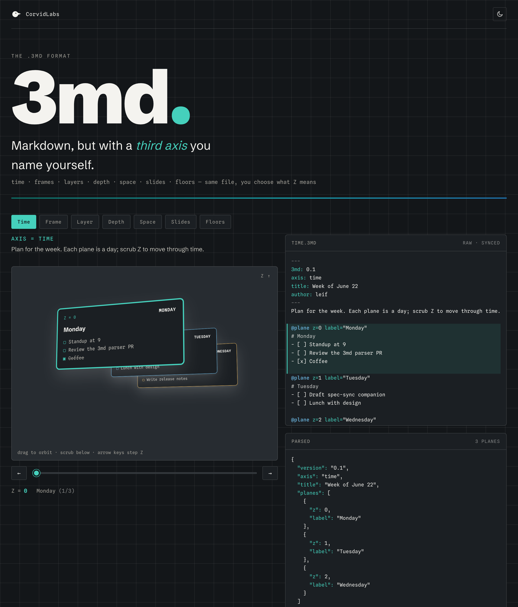
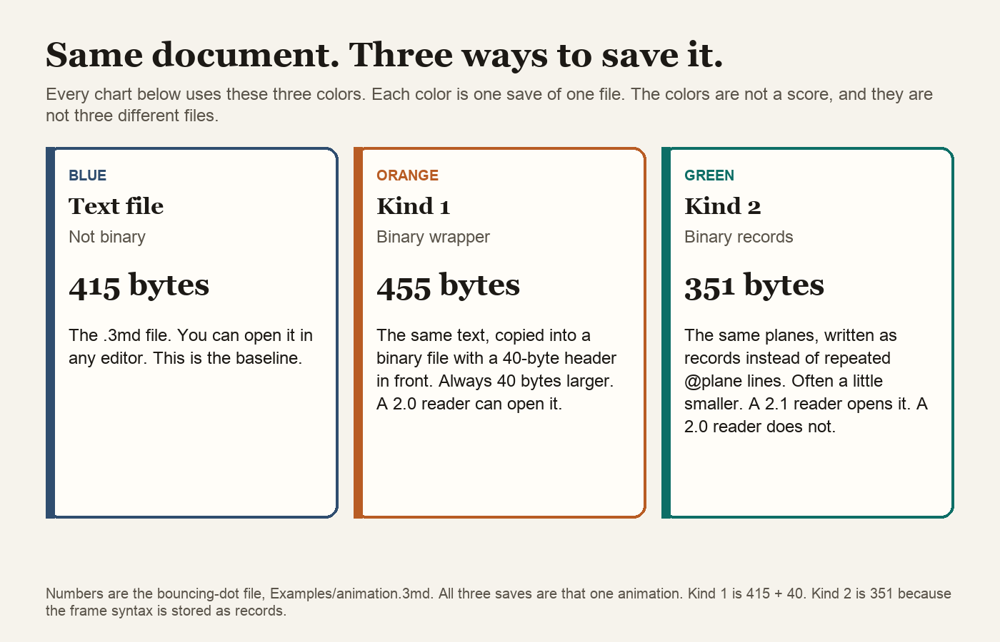
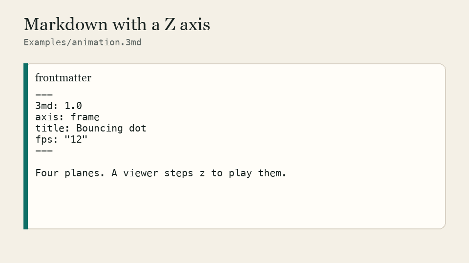
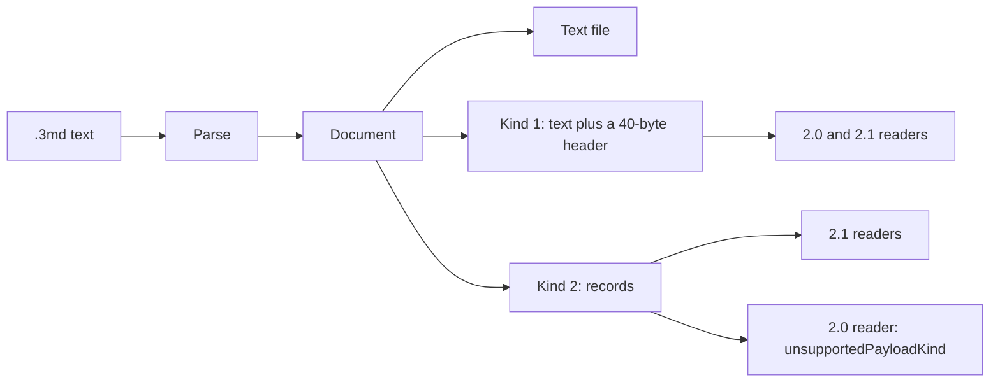
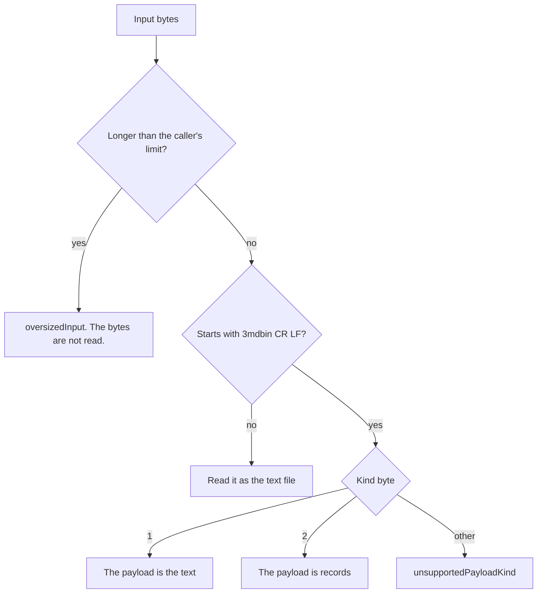
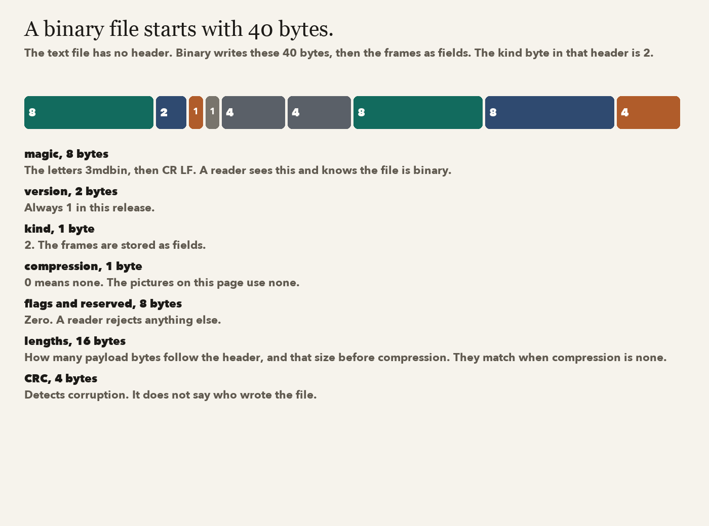
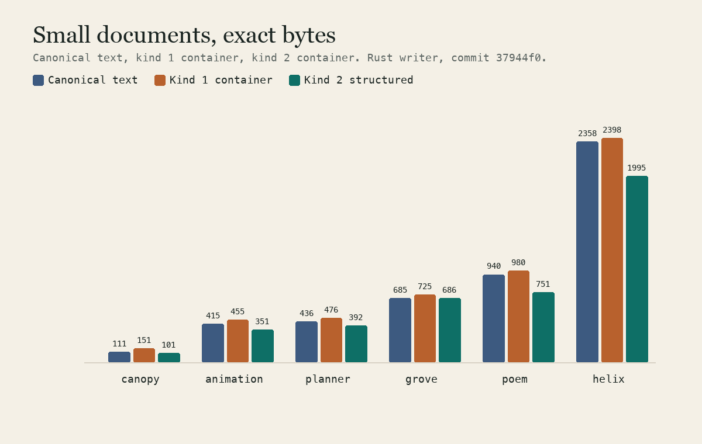
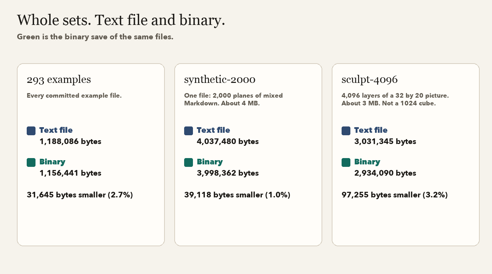
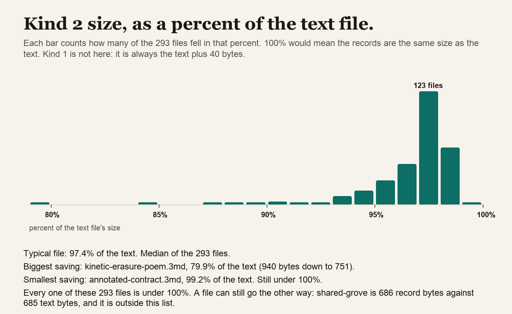
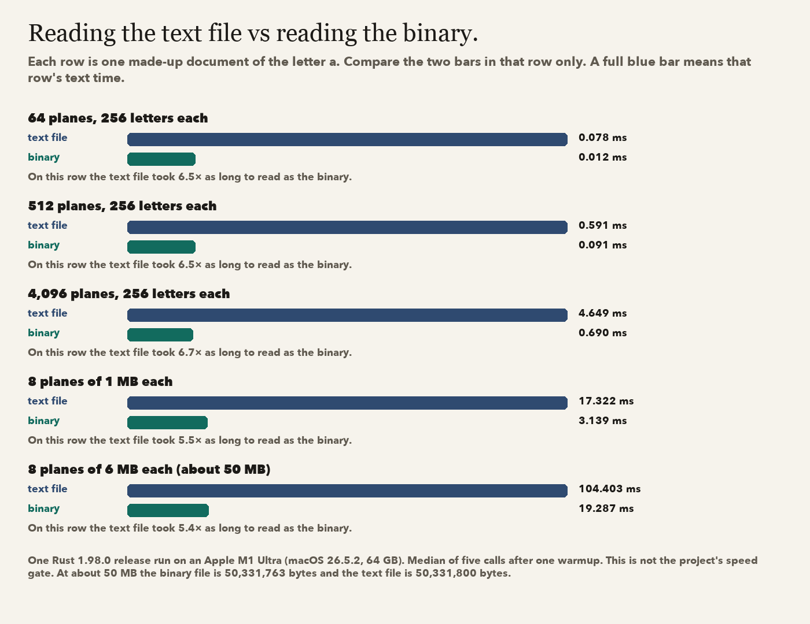

# 3md

[](https://github.com/CorvidLabs/3md/actions/workflows/trust.yml)
[](https://corvidlabs.github.io/3md/)
[](https://github.com/CorvidLabs/3md/releases)
[](LICENSE)
[](https://corvidlabs.github.io/3md/)

ThreeMD 2.0.0 adds [linked file composition](docs/FILE-COMPOSITION.md): map a
character to another 3md filename, resolve host-supplied files in any of the
three libraries, and share a self-contained bundle. See the
[nested LinkedVillage example](Examples/LinkedVillage/README.md) and the
[2.0.0 release notes](docs/RELEASE-2.0.0.md). ThreeMD 2.1
prepares payload kind 2: `.binary` writes structured document records, and
`encodeTextContainer` still writes the 2.0 kind-1 bytes. The `v2.1.0` tag is
not cut. See the [2.1 preparation notes](docs/RELEASE-2.1.0.md).

**Markdown with a Z axis.** A `.3md` file is ordinary Markdown extended along
one free axis: stack your content into **planes** and tell the reader what the
depth means. Time for a daily planner. Frames for an animation. Layers for
annotations. Space for a scene.

**[Try the interactive demo](https://corvidlabs.github.io/3md/)** (also on
[corvidlabs.xyz/3md](https://corvidlabs.xyz/3md/)), open the
**[viewer &amp; editor](https://corvidlabs.github.io/3md/viewer.html)** (paste any
`.3md` and share a link), read the
**[docs](https://corvidlabs.github.io/3md/docs.html)**, or
**[browse the curated animated gallery](https://corvidlabs.github.io/3md/gallery.html)**,
or flip through the
**[animated deck](https://corvidlabs.github.io/3md/viewer.html?src=examples-gallery.3md)**
where the strongest examples appear as motion cards.

This repo eats its own dog food: every doc here is also combined into one
[`docs.3md`](docs.3md) (each Markdown file is a plane). GitHub can't preview
`.3md` natively, so **[open all the docs in the 3md viewer](https://corvidlabs.github.io/3md/viewer.html?src=docs.3md)**
and scrub through them.

<p align="center">
  <a href="https://corvidlabs.github.io/3md/"></a>
</p>

[Same document, three saves](#same-document-three-saves) shows one file stored
as text and as two kinds of binary. A file is parsed and saved at whatever
size the process can hold.

```
---
3md: 0.1
axis: time
title: My Week
---
@plane z=0 label="Monday"
# Monday
- [ ] Standup

@plane z=1 label="Tuesday"
# Tuesday
```

This repository holds the format specification ([SPEC.md](SPEC.md)), example
documents ([Examples/](Examples)), three parsers kept in lockstep (`ThreeMD`, a
cross-platform Swift parser; a TypeScript port in [`js/`](js); and a Rust crate
in [`rust/`](rust)), and a shared cross-implementation conformance suite
([conformance/](conformance)) that all three pass.

ThreeMD 2.0.0 adds general `.3mdb` storage, self-contained document
composition, linked file composition, stable optional identities, atomic
revision-checked edits and structured diagnostics in Swift, TypeScript and Rust.
The uncompressed container and shared extension fixtures are portable. LZFSE is
available only through Swift's conditional Apple backend; the ports return an
explicit unsupported-backend error. These library APIs perform no file or
network I/O. See the [release notes and migration guide](docs/RELEASE-2.0.0.md)
and [editing capability matrix](docs/EDITING-RELEASE.md).

Cross-language file interchange is verified by a development gate: each Swift,
TypeScript and Rust writer feeds every reader, for all nine pairings. It checks
canonical text, uncompressed binary, composition references, linked-file bundles
and imported edits. The [interchange catalog](conformance/interchange/README.md) states the cases,
exact-byte checks and platform exceptions. This does not claim portable LZFSE
or a shared JSON snapshot/patch transport.

## Why

Markdown is two dimensional. Plenty of documents are not: a planner moves
through time, an annotated contract has overlay layers, an ASCII animation is a
stack of frames. 3md keeps Markdown's plain-text simplicity and adds one axis,
with the author declaring what that axis means. Nothing comparable ships today;
the closest prior art renders existing Markdown into 3D rather than giving the
text a depth dimension of its own.

## Same document, three saves

Yes. The pictures compare the non-binary text file with two binary saves of
that same document. They do not compare different documents, and the colors
are not a score. Each color is one way to save the file.

| Color | Save | What you are looking at |
| --- | --- | --- |
| Blue | Text file | The `.3md` file. Ordinary UTF-8. This is the baseline. |
| Orange | Kind 1 | That same text inside a binary file, after a 40-byte header. Always 40 bytes larger. A ThreeMD 2.0 reader can open it. |
| Green | Kind 2 | The same document as binary records. Usually a little smaller than the text. A wall of the same letter can be a few bytes larger. A 2.1 reader opens it. A 2.0 reader does not. |

Kind 1 is not compressed text. It is the text plus 40 bytes. Kind 2 is not a
zip of the text either. It stores the planes as records, so repeated `@plane`
lines are not written out again.

<p align="center">
  
</p>

[Examples/animation.3md](Examples/animation.3md) is the bouncing dot in that
picture. The text file is 415 bytes. Kind 1 is 455, which is 415 + 40. Kind 2
is 351.

<p align="center">
  
</p>

The moving picture is those four text planes, then the three saves. Blue,
orange, and green are not three different animations.

The next diagram is that same choice as a path. One parsed document can be
written three ways.


```mermaid
flowchart LR
  source[".3md text"] --> parsed[Parse]
  parsed --> document[Document]
  document --> textOut["Text file"]
  document --> kind1["Kind 1: text plus a 40-byte header"]
  document --> kind2["Kind 2: records"]
  kind1 --> both["2.0 and 2.1 readers"]
  kind2 --> current["2.1 readers"]
  kind2 --> legacy["2.0 reader: unsupportedPayloadKind"]
```

The diagram after it is how a reader decides what it was given. The default
limit is the largest integer the language can use, so a 1 GB or 5 GB file is
not refused there. The length check stops a file only when the caller passed a
smaller limit and the file is longer than that limit.


```mermaid
flowchart TD
  bytes[Input bytes] --> length{Longer than the caller's limit?}
  length -->|yes| refused["oversizedInput. The bytes are not read."]
  length -->|no| magic{Starts with 3mdbin CR LF?}
  magic -->|no| asText[Read it as the text file]
  magic -->|yes| kind{Kind byte}
  kind -->|1| asKind1[The payload is the text]
  kind -->|2| asKind2[The payload is records]
  kind -->|other| bad[unsupportedPayloadKind]
```

<p align="center">
  
</p>

That header is why kind 1 is 40 bytes larger than the text. Both binary saves
use it. The text file has no header. The byte at offset 10 is the kind: 1
means the payload is the text, 2 means the payload is records.

### Six files, three saves each

<p align="center">
  
</p>

| Document | Text file | Kind 1, text plus 40 | Kind 2 records |
| --- | ---: | ---: | ---: |
| [canopy.3md](Examples/Extensions/canopy.3md) | 111 | 151 | 101 |
| [animation.3md](Examples/animation.3md) | 415 | 455 | 351 |
| [daily-planner.3md](Examples/daily-planner.3md) | 436 | 476 | 392 |
| [shared-grove.3md](Examples/Extensions/shared-grove.3md) | 685 | 725 | 686 |
| [kinetic-erasure-poem.3md](Examples/kinetic-erasure-poem.3md) | 940 | 980 | 751 |
| [dna-double-helix.3md](Examples/dna-double-helix.3md) | 2,358 | 2,398 | 1,995 |
| [conways-game-of-life.3md](Examples/conways-game-of-life.3md) | 17,509 | 17,549 | 17,255 |

Kind 1 is the text column plus 40 on every row. Grove is the row where the
records are one byte larger than the text. The poem is the large drop in this
set: 751 bytes is 79.9% of 940. Conway is in the table and left off the
picture, so 17,509 bytes do not flatten the other bars.

### Adding many files together

<p align="center">
  
</p>

<p align="center">
  
</p>

| Input | What it is | Text bytes | Kind 1 | Kind 2 records | Kind 2 / text |
| --- | --- | ---: | ---: | ---: | ---: |
| 293 example files | The committed size list | 1,188,086 | 1,199,806 | 1,156,441 | 0.973 |
| synthetic-2000 | One file: 2,000 planes of mixed Markdown | 4,037,480 | 4,037,520 | 3,998,362 | 0.990 |
| sculpt-4096, 32 by 20 | One file: 4,096 layers of a 32 by 20 picture. Not a 1024 cube | 3,031,345 | 3,031,385 | 2,934,090 | 0.968 |

Kind 1 for the 293 files is the text total plus 293 times 40, which is 11,720
bytes. The records are 31,645 bytes smaller than the text (2.7%). A typical
file in that list has records at 97.4% of its text. The biggest saving is the
poem, at 79.9%. The smallest saving is `annotated-contract.3md`, at 99.2%.
Every file in the list is under 100%. Those totals are the committed check in
[conformance/structured/sizes.json](conformance/structured/sizes.json). The
test `g6_kind_2_sizes_match_sizes_json` checks them. The two generated files
are not committed. The sizes are.

### Reading the text vs reading the records

This picture is a speed comparison, not another size comparison. Each row is
one made-up document of the letter `a`. Blue is how long the text file took to
read. Green is how long the records took. Kind 1 is left off, because kind 1
is the text plus a header, so reading it means reading the text.

The two bars in a row compare only with each other. Do not compare bar lengths
down the picture. A full blue bar means "this row's text time," not "a big
file."

<p align="center">
  
</p>

| Document | Text bytes | Kind 2 bytes | Text read | Records read |
| --- | ---: | ---: | ---: | ---: |
| 64 planes of 256 `a` | 17,318 | 16,763 | 0.078 ms | 0.012 ms |
| 512 planes of 256 `a` | 138,690 | 134,140 | 0.591 ms | 0.091 ms |
| 4,096 planes of 256 `a` | 1,113,050 | 1,073,148 | 4.649 ms | 0.690 ms |
| 8 planes of 1 MB | 8,388,760 | 8,388,715 | 17.322 ms | 3.139 ms |
| 8 planes of 6 MB, about 50 MB | 50,331,800 | 50,331,763 | 104.403 ms | 19.287 ms |

One Rust 1.98.0 release process on an Apple M1 Ultra (macOS 26.5.2, 64 GB).
Each time is the median of five calls after one warmup. The project speed gate
is still open. It wants three processes per language, and these numbers are
not that gate. At about 50 MB, kind 2 is 37 bytes smaller than the text.

### How big a file can be

There is no fixed size stop. A 1 GB document, a 5 GB document, or any larger
document is parsed and saved when the process can hold it. Kind 2 is records,
not a compressor. A document made of 1 GB of letters stays about 1 GB as
records. The header is 40 bytes either way.

The default limit is the largest integer the language uses for a size:

| Library | Default limit |
| --- | --- |
| Swift | `Int.max` |
| Rust | `usize::MAX` |
| TypeScript | `Number.MAX_SAFE_INTEGER` (9,007,199,254,740,991) |

That one default covers the file, the decoded text, the number of lines, the
number of planes, and each line or plane body. A caller can pass a smaller
positive limit. Zero, a negative number, and a number JavaScript cannot hold
exactly are `invalidLimits`. A caller who wants the old stop can pass
67,108,864 (64 MiB).

On a 32-bit process the language integer stops near 2 GB. That is the
language. A 5 GB length does not fit in a signed 32-bit integer. A hostile
file can still use all of the machine's memory, because the library reads and
writes the document it is given.

### A page of 1024 by 1024 letters

One plane, 1024 lines of 1024 letters `a`, measured with the Rust 1.98.0
release build (median of five reads after one warmup, one run, not the speed
gate):

| Save | Bytes | Read time |
| --- | ---: | --- |
| Text file | 1,049,641 | 2.307 ms |
| Kind 1 | 1,049,681 | The text plus the 40-byte header |
| Kind 2 records | 1,049,654 | 0.384 ms |

On that page the records are 13 bytes larger than the text, because a wall of
one letter has almost no syntax to remove. They were still quicker to read in
this run.

The same number of letters, split into 1024 planes of one 1024-letter line,
does get smaller. The `@plane` lines go away: text 1,063,879 bytes, kind 2
1,054,706 bytes.

A cube of 1024 such pages is 1024 × 1024 × 1024 letters, which is
1,073,741,824 bytes before the `@plane` lines. One local run on this Apple
M1 Ultra parsed that cube and saved it again in Swift, TypeScript, and Rust.
All three wrote the same bytes: text 1,074,804,681, kind 2 records
1,074,796,532. The records are 8,149 bytes smaller than the text. Rust 1.98.0
release wrote the text in 3.413 seconds and read it in 2.539 seconds, and
wrote the records in 0.408 seconds and read them in 0.406 seconds. That run
is one process, not the speed gate.

The same Rust build also parsed and saved one plane of 5 GB of the letter
`a` (5,368,709,120 bytes). The text file was 5,368,709,164 bytes. The kind 2
file was 5,368,709,179 bytes, 15 bytes larger, because a wall of one letter
has almost no syntax to remove. Writing the text took 23.501 seconds and
reading it took 16.208 seconds. Writing the records took 2.360 seconds and
reading them took 2.348 seconds.

A one-plane body of 64 letters `a` is the tiny file that grows: text 106
bytes, kind 1 146 bytes, kind 2 117 bytes.

## Installation

### Swift Package Manager

Add the package to your `Package.swift`:

```swift
.package(url: "https://github.com/CorvidLabs/3md", from: "2.1.0")
```

Then depend on the `ThreeMD` library product:

```swift
.product(name: "ThreeMD", package: "3md")
```

`from: "2.1.0"` resolves only after the `v2.1.0` tag exists. Until that GitHub
release, `from: "2.0.0"` is the published package. Read the
[2.1 migration notes](docs/MIGRATION-2.1.md) before upgrading: a 2.0 reader
rejects kind 2, and Rust's canonical number spelling changes for 92 powers of
two. The [2.0 migration guide](docs/RELEASE-2.0.0.md#migrating-an-existing-host)
still covers the earlier lossy-serialization change.

### JavaScript / TypeScript

A TypeScript library lives in [`js/`](js), alongside the
[`<three-md>` web component](element/) (`@corvidlabs/three-md-element`).
All three implementations (Swift, TypeScript, and the Rust crate in [`rust/`](rust))
are kept in sync by the shared conformance suite ([conformance/](conformance)).

The [publication workflow](.github/workflows/publish.yml) publishes to the
public npm registry. Install with:

```bash
bun add @corvidlabs/threemd
```

The package manifests on this branch read 2.1.0. npm still serves 2.0.0 until
the GitHub release runs the publish workflow. If an older installation maps
`@corvidlabs` to GitHub Packages, point that scope at the public npm registry.
The web component keeps text rendering; the library exports the storage,
composition, linked-file and editing APIs.

No install needed just to use it: try the hosted [editor and
viewer](https://corvidlabs.github.io/3md/viewer.html), or load the self-contained
component bundle directly with `<script type="module" src=".../three-md.js">`.

```ts
import { danglingLinks, linkGraph, parse, serialize } from "@corvidlabs/threemd";

const document = parse(source);
console.log(document.axis); // "time"
console.log(danglingLinks(document)); // unresolved [[z=N]] references
console.log(linkGraph(document));     // compact source -> target edge list

// Round trips back to text:
const text = serialize(document);
```

### Rust

The [`threemd`](https://crates.io/crates/threemd) crate's publication workflow
targets crates.io. Install an available published version with:

```bash
cargo add threemd
```

The prepared crate version is 2.1.0 and still pins
`unicode-normalization =0.1.25`. Its serde/serde_json dependencies are
development-only. crates.io stays at the last published release until the
GitHub release runs the publish workflow and `CRATES_IO_TOKEN` is configured.
Confirm the registry version before depending on it.

```rust
let document = threemd::parse(source)?;
println!("{}", document.axis); // "time"
```

## Library usage

ThreeMD 2.0.0 adds optional stable plane/reference identities, immutable
revision-checked document/composition patches and structured diagnostics above
the existing parser in Swift, TypeScript and Rust. General uncompressed binary,
composition and linked-file APIs are implemented in all three. See the
[release scope and capability matrix](docs/EDITING-RELEASE.md). Releases before
2.0.0 do not contain these APIs.

```swift
import ThreeMD

let document = try Parser().parse(source)
print(document.axis)          // Axis(rawValue: "time")
for plane in document.planesByZ {
    print(plane.label ?? "", plane.body)
}
print(document.danglingLinks()) // unresolved [[z=N]] references
print(document.linkGraph())     // compact source -> target edge list

// Round trips back to text:
let text = Serializer().render(document)
```

## Binary storage and reusable documents

The byte counts, the GIF, and the 1 GB refusal are in
[Same document, three saves](#same-document-three-saves). ThreeMD 2.0.0 provides
bounded general-document storage and self-contained composition in Swift,
TypeScript and Rust. The examples below use Swift; see
[EDITING-RELEASE.md](docs/EDITING-RELEASE.md) for the TypeScript and Rust
equivalents. The existing text parsers, command-line tool and hosted viewer
retain their current text behavior.

```swift
import ThreeMD

let document = try Parser().parse(source)
let binary = try DocumentStorageCodec.encode(
    document, format: .binary(compression: .none)
)
let restored = try DocumentStorageCodec.decode(binary)

// Optional on platforms with Apple's Compression framework:
let compressed = try DocumentStorageCodec.encode(
    document, format: .binary(compression: .lzfse)
)
```

`.binary` writes payload kind 2: structured document records inside the
unchanged version 1 container. The records are often a little smaller than the
text, and a page of repeated letters can be a few bytes larger. Decoding them
does not parse that text. `encodeTextContainer` writes payload kind 1, the
ThreeMD 2.0 canonical UTF-8 payload, for a reader that does not know kind 2.
A 2.0 reader stops on kind 2 with `unsupportedPayloadKind(2)`.

```swift
let legacy = try DocumentStorageCodec.encodeTextContainer(document)
```

The magic is `3mdbin\r\n`. It is separate from Sculpt/Rook's older
voxel-specific `3MDB` container. The default storage limit is the largest
integer the language can use. A caller can pass a lower positive limit.
[How big a file can be](#how-big-a-file-can-be) explains that, including a
32-bit process and a page of 1024 by 1024 letters.
Unavailable compression, malformed headers, a non-positive limit, and cancellation produce errors.
CRC detects corruption and does not authenticate content. Kind 1 and kind 2
both use that checksum.

Composition preserves a library of named documents and ordered references:

```swift
let root = Document(version: "0.1", axis: .layer, planes: [
    Plane(z: 0, body: "# Collection")
])
let composition = try DocumentComposition(rootID: "root", entries: [
    DocumentEntry(id: "root", document: root, references: [
        DocumentReference(targetID: "chapter", attributes: ["role": "first"]),
        DocumentReference(targetID: "chapter", attributes: ["role": "again"])
    ]),
    DocumentEntry(id: "chapter", document: document)
])
let text = try DocumentCompositionCodec.encode(composition)
let reloaded = try DocumentCompositionCodec.decode(text)

// The profile is itself a normal Document, so binary storage also works.
let profile = try DocumentCompositionCodec.document(for: composition)
let binaryComposition = try DocumentStorageCodec.encode(
    profile, format: .binary(compression: .none)
)
```

Each definition is saved once. All references resolve inside the supplied
library, with checked IDs, targets, cycles, depth and work limits, including
unused definitions. Documents keep their own axes; attributes have no built-in
voxel or layout meaning. The library performs no file reads, URL resolution or
automatic flattening. See [SPEC.md](SPEC.md#11-general-document-storage) for the
binary layout and [the composition profile](SPEC.md#12-self-contained-document-composition).

The package keeps its existing deployment baseline. These synchronous APIs
check cooperative task cancellation on macOS 10.15, iOS 13, tvOS 13, watchOS 6
and later, and supported non-Apple platforms. On earlier Apple runtimes that
check is a no-op; storage and validation remain synchronous and available.

Actual canonical fixtures are in [Examples/Extensions](Examples/README.md#storage-and-composition-fixtures):
[readable canopy](Examples/Extensions/canopy.3md),
[portable binary canopy](Examples/Extensions/canopy.3mdb),
[readable shared grove](Examples/Extensions/shared-grove.3md), and
[portable binary shared grove](Examples/Extensions/shared-grove.3mdb).
The fixture directory also includes LZFSE variants and a byte/hash manifest.
The public Swift APIs generated all six documents and decoded them back to
equal values. This demonstrates storage and references, without promising
automatic character-to-model expansion or hosted viewer support.

### Linked files

An ordinary document can name other 3md files in a `3md-files` metadata ledger
that maps single printable ASCII characters to relative filenames:

```
3md-files: "{\"1\":\"models/house.3md\",\"2\":\"models/tree.3md\"}"
```

The host reads the files it chooses and supplies their bytes. The library
resolves the graph and can bundle it into the self-contained profile above:

```swift
let linked = try DocumentFileComposition.resolve(
    rootPath: "scene.3md",
    sources: [DocumentFileSource(path: "scene.3md", data: sceneBytes),
              DocumentFileSource(path: "models/house.3md", data: houseBytes),
              DocumentFileSource(path: "models/tree.3md", data: treeBytes)]
)
let portable = try DocumentCompositionCodec.encode(linked.composition)
```

Paths are project-relative POSIX paths that cannot escape the root. Missing
files, cycles, invalid ledgers and exceeded limits are refused without partial
results. See [FILE-COMPOSITION.md](docs/FILE-COMPOSITION.md),
[SPEC.md section 12.3](SPEC.md#123-linked-file-authoring) and the
[LinkedVillage example](Examples/LinkedVillage/README.md).

## Command-line tool

The `threemd` CLI ships with the package and self-documents (run `threemd
--help`). A path of `-` reads from standard input.

```bash
swift run threemd validate <file>   # parse a file; print "ok" or exit non-zero with the error
swift run threemd info <file>       # print version, axis, title, and each plane's position
swift run threemd links <file>      # list cross-plane links and dangling references
swift run threemd check-links <file> # exit non-zero when any [[z=N]] target is missing
swift run threemd html <file>       # render the document to HTML on stdout
```

`validate`, `info`, `links`, and `check-links` also accept `--json` for CI,
editor integrations, and other tooling.

## Format at a glance

- A required `---` frontmatter block declares `3md:` (the version, and the file's
  magic marker), an optional `axis:`, an optional `title:`, and free metadata.
- `@plane z=... label="..."` directives start planes; the Markdown between
  directives is the plane body.
- A plain Markdown file with a 3md header and no directives is a valid one-plane
  document.

See [SPEC.md](SPEC.md) for the full grammar and conformance rules.

## Examples

The [Examples/](Examples) directory holds the source example documents across
13 axis types - from medical charts, weather, and file transfers to games,
maps, and animations. The
[gallery viewer](https://corvidlabs.github.io/3md/gallery.html) highlights the
curated animated set; a few source examples:

- [`daily-planner.3md`](Examples/daily-planner.3md) - `axis: time`, one plane per day.
- [`animation.3md`](Examples/animation.3md) - `axis: frame`, one plane per frame.
- [`layered-notes.3md`](Examples/layered-notes.3md) - `axis: layer`, stacked overlay layers.
- [`dungeon.3md`](Examples/dungeon.3md) - `axis: space`, rooms wired with `[[z=N]]` cross-plane links.
- [`tide-pool.3md`](Examples/tide-pool.3md) - `axis: depth`, authored by an AI from the spec alone (see [docs/PROOF.md](docs/PROOF.md)).
- [`game-of-life.3md`](Examples/game-of-life.3md) - `axis: frame`, a real 24-generation Conway run (animates, and renders as a 3D object in the viewer's blend view).
- [`3md-in-3md.3md`](Examples/3md-in-3md.3md) - 3md explained in 3md, with a `@plane` inside a code fence.
- Plus `recipe`, `changelog`, `resume`, and `kanban`.

Want to see it work? [docs/PROOF.md](docs/PROOF.md) records how 3md was verified
for machines (a blind AI authored valid 3md from the spec; all three parsers
agreed) and for people (plain, readable, diffable text).

## Development

This repo uses the CorvidLabs trust toolchain. Run the complete repository gate
before calling a change done:

```bash
fledge trust verify
```

Trust validates the SpecSync contract, risk policy, and provenance posture, and
composes the native `fledge lanes run verify` lane. That native lane runs the
Swift format check, build, and tests plus the Rust crate, TypeScript parser
parity, generated web-component bundle drift, and VS Code grammar tests. See
[AGENTS.md](AGENTS.md) for the standing rules every contributor and agent follows.
Browser UI tests are exposed separately with `fledge lanes run ui`.

Each implementation has its own tests, and all three implementations run the shared 43-vector
conformance suite in [conformance/](conformance), which is the
cross-implementation contract that keeps the parsers behaving identically.

## Status

The 1.0 text grammar remains frozen. Specification 1.1 adds independently
versioned binary storage, composition and linked file authoring without changing
that grammar. ThreeMD 2.0.0, released on 2026-10-06, implements those extensions
in Swift, TypeScript and Rust; the package version is separate from the format
version. Specification 1.2 is on main (pull request 72). It adds payload kind 2
inside that same container. Package manifests read 2.1.0. The `v2.1.0` tag is
not cut. See the [2.1 preparation notes](docs/RELEASE-2.1.0.md). Older
`3md: 0.1` documents remain valid: the parser is version-lenient and never
rejects a document by its version string.

## License

MIT (c) CorvidLabs. See [LICENSE](LICENSE).
