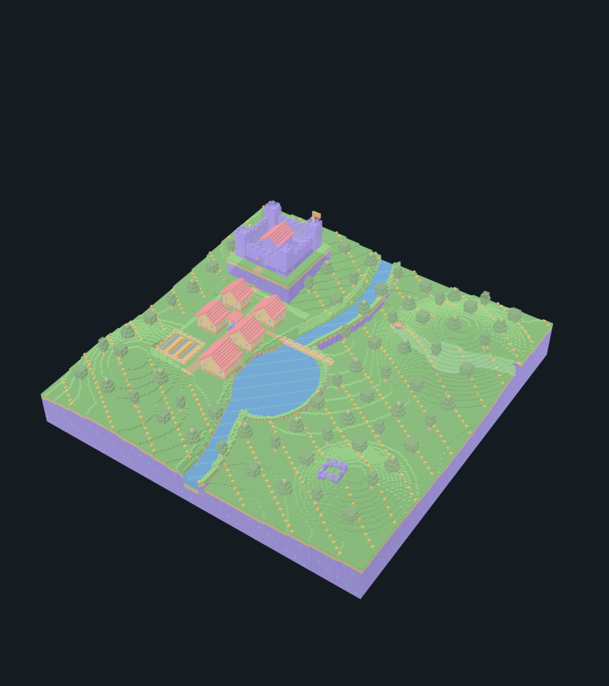

# Blockhaven

An original block landscape for Sculpt.3md: a river and lake, hills, caves, trees, a village with paths and farms, and a castle. It uses the app's glyph colors and deterministic Swift geometry. It contains no Minecraft assets and does not use Minecraft's game runtime or world file format.

| File | Use |
| --- | --- |
| [blockhaven.3md](blockhaven.3md) | Editable composition: a 6 × 6 map referencing 36 reusable chunk models. |
| [blockhaven-world.3md](blockhaven-world.3md) | Sparse world with 36 aligned chunk placements; select, move, rotate, or remove instances. |
| [blockhaven.3mdb](blockhaven.3mdb) | Expanded compact voxel document for cell and slice editing. |
| [blockhaven.png](blockhaven.png) | 1152 × 1296 landscape overview. |
| [blockhaven.gif](blockhaven.gif) | Looping four-second turntable, 576 × 648 at 10 frames per second. |
| [blockhaven.mp4](blockhaven.mp4) | Silent H.264 turntable with the same duration and frame size. |
| [blockhaven.obj](blockhaven.obj) | Exterior voxel surface mesh, grouped by glyph material. |
| [manifest.json](manifest.json) | Dimensions, model and instance counts, occupied cells, media settings, and exact artifact byte counts. |

Each chunk is 32 × 64 × 32 cells. The composition contains 37 definitions: its root map and 36 chunks. Expanding the whole landscape produces 192 × 64 × 192 cells. The sparse world preserves the same layout through explicit model references and exact origins, without allocating empty space outside those placements. The composition and world embed their libraries; neither needs external model files.

Open the composition to change its tile map and model bindings, the world to arrange its chunks, or the compact file to edit individual voxels. Material characters choose the editor's existing stylized palette. PNG, GIF, and MP4 use cube rendering at opacity 0.8; OBJ contains occupied block geometry, not glyph outlines. Shared interior faces are omitted from the mesh.

The Swift development command `RookTool blockhaven` regenerates only this folder's artifacts. `RookTool examples` also includes Blockhaven while retaining the original gallery and courtyard records. Generation stages all seven artifacts before publishing them, refuses symbolic-link destinations, and writes the manifest last. Matching source documents, media settings, and recorded file sizes permit unchanged artifacts to be retained. These generation protections do not make the seven-file publication a single filesystem transaction.

Artifact tests check the source graphs against the deterministic model, compact expansion, file sizes and links, decoded PNG geometry, GIF loop/timing and changing views, silent MP4 frames, and complete outward-facing OBJ surfaces. Test execution and visual verification are recorded separately by the root workflow; this README is not a claim of completed verification.
