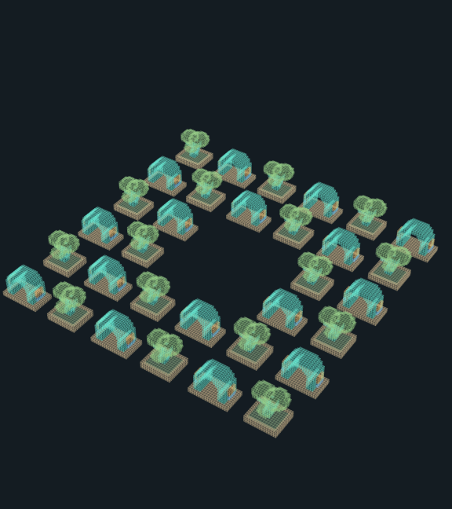

# Compositions and sparse worlds

These examples extend the [sculpture gallery](../README.md) with reusable models. Their readable 3md files contain their model libraries; opening them does not load a path or URL.

The courtyard uses `C` to place a garden tile. That garden uses `T` and `G` to place a tree and a gate. Eight garden tiles share four model definitions, producing sixteen trees and sixteen gates in a 144 × 24 × 144 expanded sculpture.

| Courtyard format | Contents |
| --- | --- |
| [3md](courtyard.3md) | Editable nested composition and shared model definitions |
| [Compact sculpture](courtyard.3mdb) | Explicitly expanded voxel copy |
| [PNG](courtyard.png) | Expanded preview |
| [GIF](courtyard.gif) | Four-second looping turntable |
| [MP4](courtyard.mp4) | Four-second silent turntable |
| [OBJ](courtyard.obj) | Expanded voxel mesh |



The visual, compact and mesh exports are expanded copies. The readable composition retains its references. [manifest.json](manifest.json) records artifact byte counts separately from the original gallery manifest.

[Wide world](wide-world.3md) places four gardens from one shared library. Its last placement is at X = 1,000,000,000,000 and Z = −1,000,000,000,000. Empty space between placements consumes no voxel storage. Open the file, select an instance and choose **Jump to it**; render and detail distances control what appears nearby. Placements outside the view remain in the saved document.

Whole-world mesh, movie and dense exports are not available. **Open model voxels** makes an editable, bounded voxel copy of one model. See [composition](../../docs/composable-3md.md) and [sparse-world](../../docs/sparse-worlds.md) details and finite capacity limits.

Regenerate these files with the Swift development tool:

```text
swift run --configuration release --quiet RookTool examples
```
