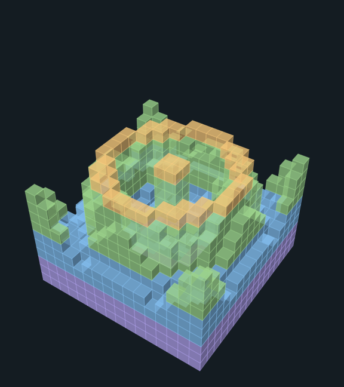
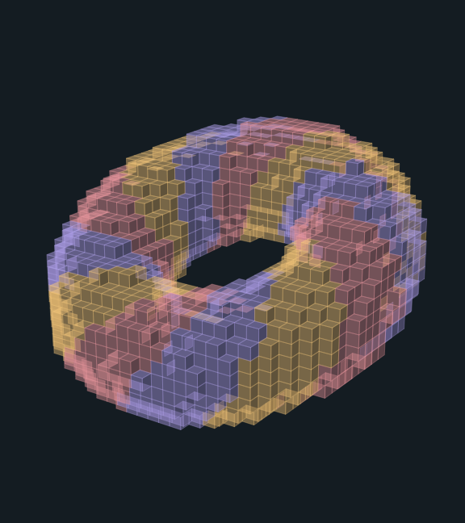
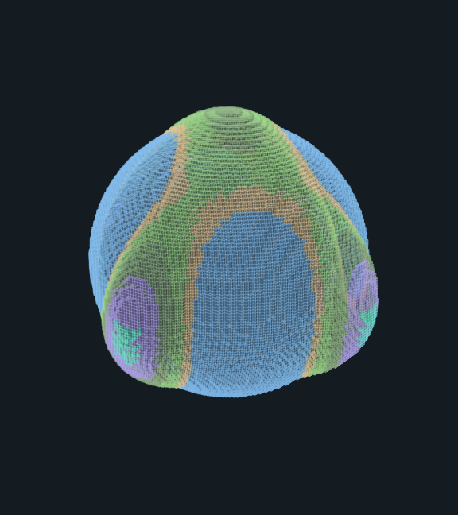
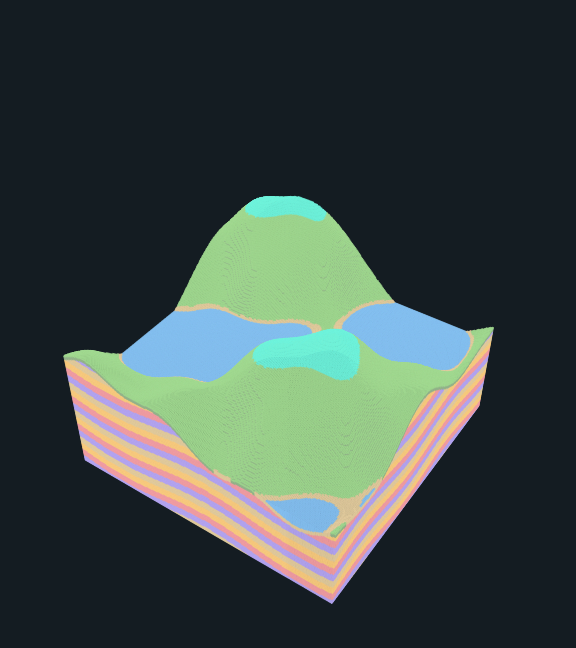

# Math ladder

Five models generated only from formulas, at growing sizes: 16, 32, 64, 128 and 256 cells per axis. Each model evaluates its formula at every cell center and picks a palette character from a second formula for color bands. Y is measured upward in the formulas. Generation is deterministic, so the same entry always produces the same document. The built-in gallery catalog lists these entries in its **Math ladder** category.

To keep the repository small, this folder commits readable 3md documents for the 16 to 128 cell models, PNG previews of all five models and [manifest.json](manifest.json). The 256 cell model is written on request with the command below.

| Entry | Size | Occupied cells | Preview | Committed files |
| --- | --- | --- | --- | --- |
| **Sine ripple**<br/>`math-ripple-16` | 16 × 16 × 16 | 1,836 | <a href="math-ripple-16.png"></a> | [3md](math-ripple-16.3md) (5,124 bytes), [PNG](math-ripple-16.png) |
| **Striped torus**<br/>`math-torus-32` | 32 × 32 × 32 | 4,184 | <a href="math-torus-32.png"></a> | [3md](math-torus-32.3md) (35,254 bytes), [PNG](math-torus-32.png) |
| **Gyroid shell**<br/>`math-gyroid-64` | 64 × 64 × 64 | 20,136 | <a href="math-gyroid-64.png"></a> | [3md](math-gyroid-64.3md) (269,077 bytes), [PNG](math-gyroid-64.png) |
| **Harmonic planet**<br/>`math-harmonic-sphere-128` | 128 × 128 × 128 | 482,478 | <a href="math-harmonic-sphere-128.png"></a> | [3md](math-harmonic-sphere-128.3md) (2,119,187 bytes), [PNG](math-harmonic-sphere-128.png) |
| **Layered sine terrain**<br/>`math-terrain-256` | 256 × 256 × 256 | 6,909,374 | <a href="math-terrain-256.png"></a> | [PNG](math-terrain-256.png) only |

## Formulas

Model coordinates are cell centers measured from the volume's corner, so cell `x` is sampled at `x + 0.5`, and Y is measured upward. Every centering offset is written out, so each formula alone reproduces its model's occupied cells.

- **Sine ripple:** `fill y <= 7.5 + 5.5 cos(1.15 r) exp(-0.07 r), r = hypot(x - 8, z - 8); band = floor(y / 3.2)`
- **Striped torus:** `(hypot(x - 16, z') - 10)^2 + y'^2 <= 4.6^2, (y', z') = (y - 16, z - 16) rotated -0.45 rad about X; stripe = floor((12 theta + 3 phi) / 2 pi) mod 3`
- **Gyroid shell:** `|sin X cos Y + sin Y cos Z + sin Z cos X| < 0.25, X = 2 pi x / 32, inside radius 31.5 of (32, 32, 32); band = floor(6 y / 64)`
- **Harmonic planet:** `r <= 46 + 16 (0.5 (nx^4 - 6 nx^2 nz^2 + nz^4) + 0.15 (5 ny^3 - 3 ny) + 1.82 nx ny nz), p = (x - 64, y - 64, z - 64), r = |p|, n = p / r; ocean to r = 47; altitude bands every 2 cells; core and mantle by radius`
- **Layered sine terrain:** `h = 100 + 40 sin(x / 41 + 0.3) cos(z / 53) + 22 sin((x + 2z) / 67) + 9 sin(x / 13) sin(z / 17); sea 80, snow 150, strata = floor((y + 5 sin(x / 29) + 4 cos(z / 23)) / 8)`

[manifest.json](manifest.json) carries each formula exactly as the gallery shows it and as written above.

## Writing the 256 cell model

`RookTool sculpture math ENTRY_ID NEW.3md|NEW.3mdb` generates any ladder model and writes it to a new file you choose. Readable 3md uses `.3md` and compact storage uses `.3mdb`. Progress goes to standard error in steps of ten percent; standard output receives a JSON receipt with the entry's size, counts, format and byte count. The output directory must already exist. The document must reopen to the generated scene before it is published, and an existing file or symbolic link at the output is never replaced.

The example below writes outside the checkout, as [agent-commands.md](../agent-commands.md) does, so this large file is never staged by accident. Remove an earlier output first, because an existing file is refused.

```text
swift run --quiet RookTool sculpture math math-terrain-256 /private/tmp/terrain-256.3mdb
```

Measured output sizes: the 256 cell model is 16,854,168 bytes as readable 3md and 297,270 bytes as compact 3mdb. Both stay within the 20 MiB native reopen limit.

## Reproducing this folder

`RookTool math-ladder` regenerates only this folder: the nine files above and the manifest, written last. It does not read or write the other example folders. `RookTool examples` also writes this folder after the gallery, compositions and Blockhaven. PNG previews use translucent cubes at 576 × 648 pixels; [manifest.json](manifest.json) records each preview's opacity and camera, occupied cells, and the byte count of every committed file.

```text
swift run --quiet RookTool math-ladder
```

Tool tests compare the manifest and the formulas above with the gallery catalog, check every committed file and its recorded size, and regenerate the 16 to 128 cell 3md files byte for byte. They regenerate the 256 cell model's record, including its occupied cells, and every PNG preview; previews must have the same size, and at most 1 in 200 bytes may differ by more than 2, because antialiased edges can shift slightly between macOS releases. They also write a model to a new file that reopens. Test execution is recorded separately; this README is not a claim of completed verification.
