# ASCII sculpture gallery

See [compositions and sparse worlds](Compositions/README.md) for a nested courtyard, its exports, and a world with widely separated placements.

See [the math ladder](Math/README.md) for formula-generated models from 16 to 256 cells per axis.

Twenty-one editable sculptures and spatial scenes, with five formats each: 105 artifacts. Choose **Examples** in Sculpt.3md to start from an editable copy, or open a `.3md` file below. Click a preview for the full PNG; GIFs show a looping turntable and MP4s are silent H.264 videos.

All previews are 576 × 648 pixels. Both animation formats contain one four-second revolution at 10 frames per second. The original twelve examples retain their ASCII previews. Eight detailed 64 × 64 × 64 scenes and Grand solar system at 256 × 256 × 256 use translucent cubes to show their structures and depth. Maps, worlds, and Space use a higher viewpoint. The solar system's sizes and distances are artistically compressed into one editable volume.

An additional [compact Grand solar system](grand-solar-system.3mdb) is available for Sculpt.3md: 60,313 bytes instead of 16,854,166 bytes as readable 3md. Both files contain the same title and 256-cubed volume. The compact `.3mdb` container is app-specific; the five-format gallery and manifest below retain readable `.3md` for interchange. See [compact storage](../docs/compact-storage.md).

| Example | PNG preview | 3md | GIF | Video | OBJ |
| --- | --- | --- | --- | --- | --- |
| **Character orb** A hollow shell with a readable interior. | <a href="character-orb.png">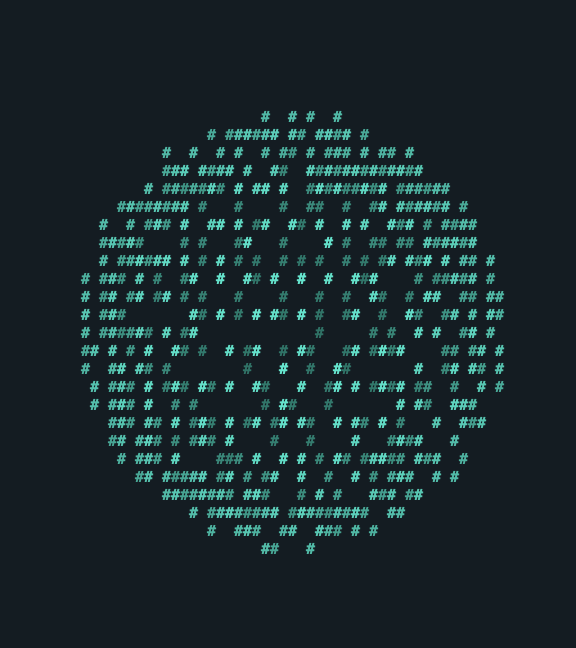</a> | [Edit](character-orb.3md) | [Loop](character-orb.gif) | [MP4](character-orb.mp4) | [Mesh](character-orb.obj) |
| **Woven torus** A striped ring around an open center. | <a href="woven-torus.png">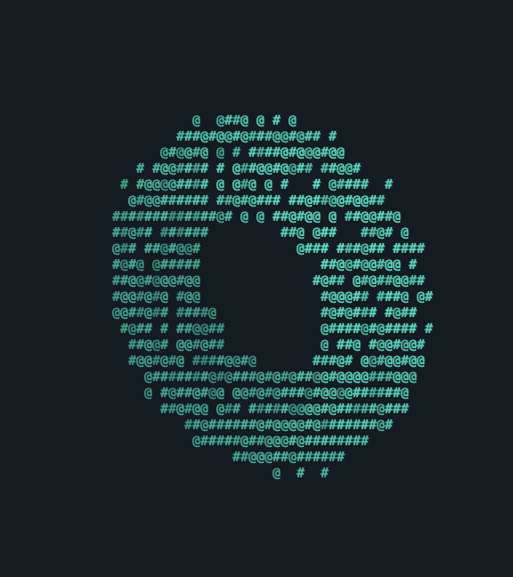</a> | [Edit](woven-torus.3md) | [Loop](woven-torus.gif) | [MP4](woven-torus.mp4) | [Mesh](woven-torus.obj) |
| **Moon gate** An arch, stepped plinth and lanterns. | <a href="moon-gate.png">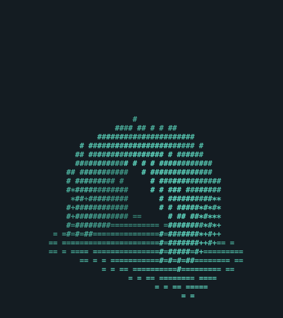</a> | [Edit](moon-gate.3md) | [Loop](moon-gate.gif) | [MP4](moon-gate.mp4) | [Mesh](moon-gate.obj) |
| **Spiral tower** A helix climbing around a central mast. | <a href="spiral-tower.png">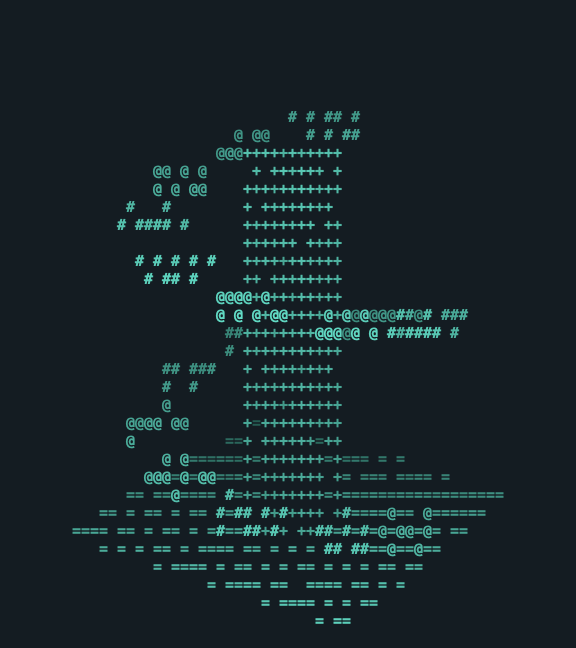</a> | [Edit](spiral-tower.3md) | [Loop](spiral-tower.gif) | [MP4](spiral-tower.mp4) | [Mesh](spiral-tower.obj) |
| **Crystal garden** Four faceted crystals on a rocky bed. | <a href="crystal-garden.png">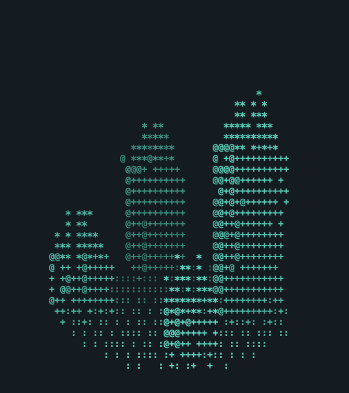</a> | [Edit](crystal-garden.3md) | [Loop](crystal-garden.gif) | [MP4](crystal-garden.mp4) | [Mesh](crystal-garden.obj) |
| **Little rocket** A hollow hull, window, fins and plume. | <a href="little-rocket.png">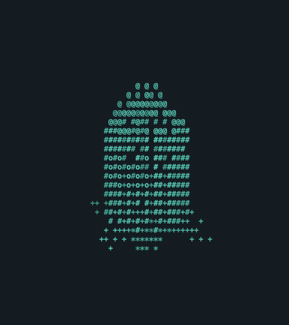</a> | [Edit](little-rocket.3md) | [Loop](little-rocket.gif) | [MP4](little-rocket.mp4) | [Mesh](little-rocket.obj) |
| **Pixel bonsai** A branching trunk and canopy in a pot. | <a href="pixel-bonsai.png">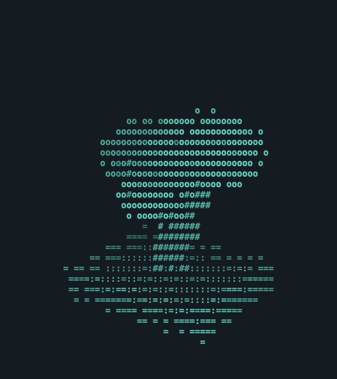</a> | [Edit](pixel-bonsai.3md) | [Loop](pixel-bonsai.gif) | [MP4](pixel-bonsai.mp4) | [Mesh](pixel-bonsai.obj) |
| **Orbital rings** Three perpendicular hoops around a star. | <a href="orbital-rings.png">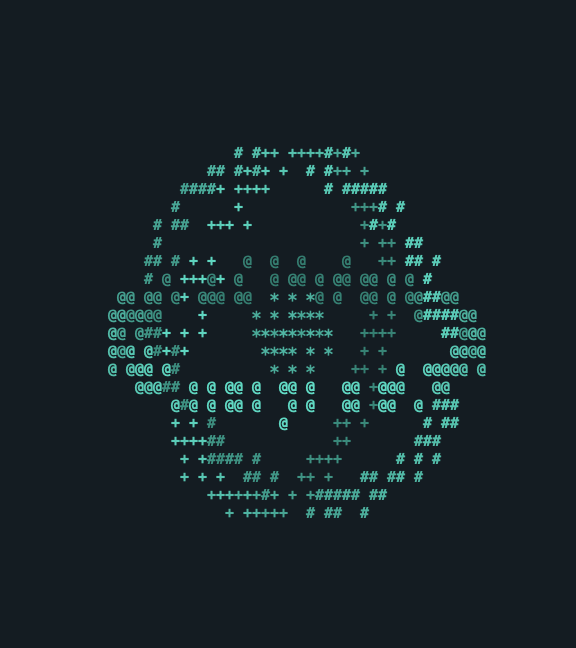</a> | [Edit](orbital-rings.3md) | [Loop](orbital-rings.gif) | [MP4](orbital-rings.mp4) | [Mesh](orbital-rings.obj) |
| **Hill observatory** A domed tower, viewing slit and stair. |  | [Edit](hill-observatory.3md) | [Loop](hill-observatory.gif) | [MP4](hill-observatory.mp4) | [Mesh](hill-observatory.obj) |
| **Terraced island** Raised land, a stream, trees and bridge. |  | [Edit](terraced-island.3md) | [Loop](terraced-island.gif) | [MP4](terraced-island.mp4) | [Mesh](terraced-island.obj) |
| **Canal city** Roofed blocks, quays and a canal bridge. | <a href="canal-city.png">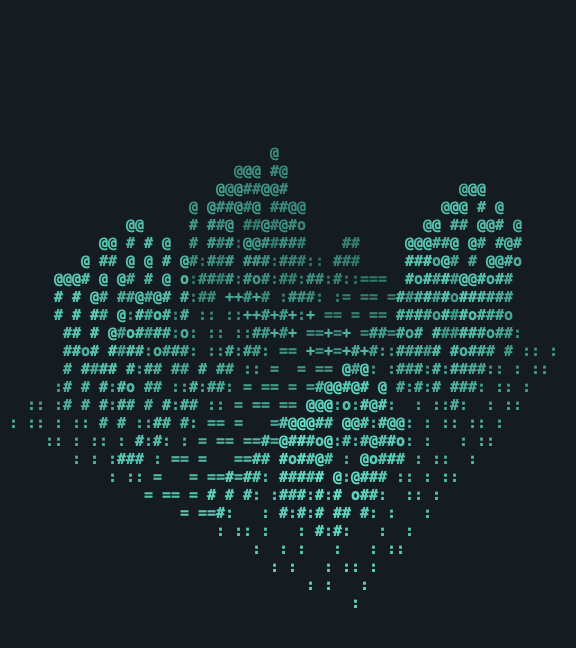</a> | [Edit](canal-city.3md) | [Loop](canal-city.gif) | [MP4](canal-city.mp4) | [Mesh](canal-city.obj) |
| **Alpine valley** Snowy peaks, a river, cabin and forest. | <a href="alpine-valley.png">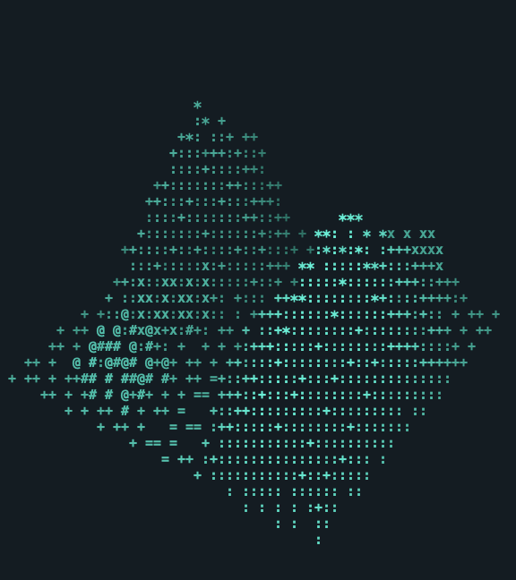</a> | [Edit](alpine-valley.3md) | [Loop](alpine-valley.gif) | [MP4](alpine-valley.mp4) | [Mesh](alpine-valley.obj) |
| **Wandering cartographer** A posed explorer with a face, coat, boots, map and walking staff. |  | [Edit](wandering-cartographer.3md) | [Loop](wandering-cartographer.gif) | [MP4](wandering-cartographer.mp4) | [Mesh](wandering-cartographer.obj) |
| **Clockwork dragon** Raised membrane wings, horns, an open jaw, clawed feet and a curling tail. |  | [Edit](clockwork-dragon.3md) | [Loop](clockwork-dragon.gif) | [MP4](clockwork-dragon.mp4) | [Mesh](clockwork-dragon.obj) |
| **Woodland fox** Pointed ears, a long muzzle, separated paws and a sweeping pale-tipped tail. | <a href="woodland-fox.png">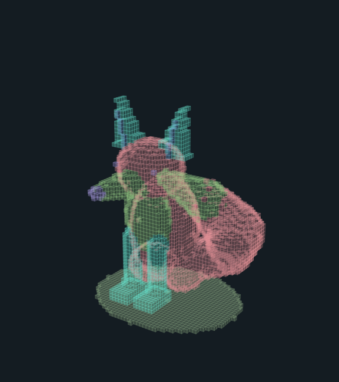</a> | [Edit](woodland-fox.3md) | [Loop](woodland-fox.gif) | [MP4](woodland-fox.mp4) | [Mesh](woodland-fox.obj) |
| **Deep sea whale** Broad flippers, a notched fluke, throat pleats and a branching spout. | <a href="deep-sea-whale.png">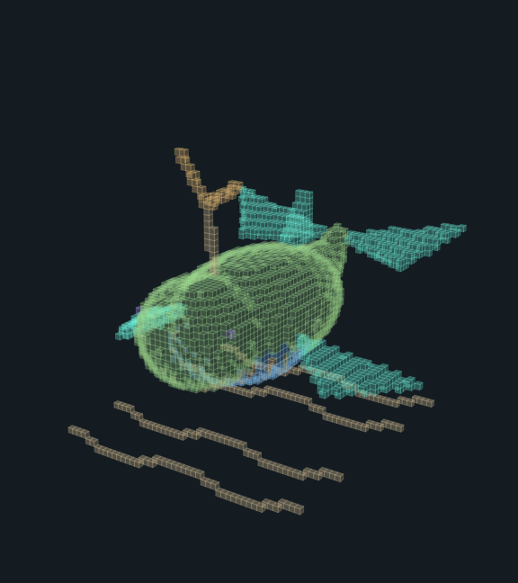</a> | [Edit](deep-sea-whale.3md) | [Loop](deep-sea-whale.gif) | [MP4](deep-sea-whale.mp4) | [Mesh](deep-sea-whale.obj) |
| **Citadel of arches** A moated castle with four towers, battlements, an open gate, keep and courtyard. |  | [Edit](citadel-of-arches.3md) | [Loop](citadel-of-arches.gif) | [MP4](citadel-of-arches.mp4) | [Mesh](citadel-of-arches.obj) |
| **Sky island village** Three floating islands, rope bridges, roofed homes, trees and a windmill. | <a href="sky-island-village.png">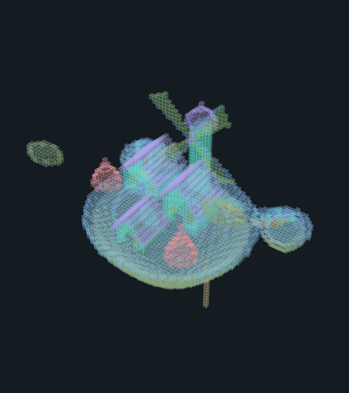</a> | [Edit](sky-island-village.3md) | [Loop](sky-island-village.gif) | [MP4](sky-island-village.mp4) | [Mesh](sky-island-village.obj) |
| **Canyon waterfall** Layered cliffs, flowing water, a hollow stone arch, carved cave and watchtower. | <a href="canyon-waterfall.png">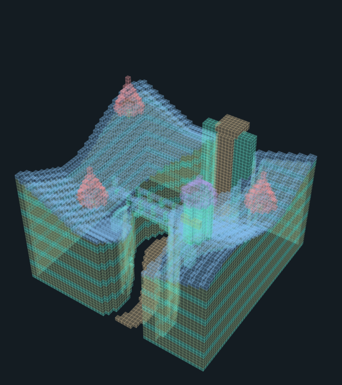</a> | [Edit](canyon-waterfall.3md) | [Loop](canyon-waterfall.gif) | [MP4](canyon-waterfall.mp4) | [Mesh](canyon-waterfall.obj) |
| **Moonlit harbor** A carved crescent moon above a village, lighthouse, wooden piers and sailboats. | <a href="moonlit-harbor.png">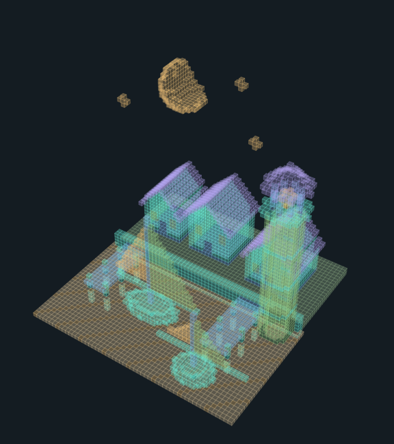</a> | [Edit](moonlit-harbor.3md) | [Loop](moonlit-harbor.gif) | [MP4](moonlit-harbor.mp4) | [Mesh](moonlit-harbor.obj) |
| **Grand solar system** The Sun and eight planets, Saturn rings, moons, asteroids, a comet and stars at an artistic scale. |  | [Edit](grand-solar-system.3md) | [Loop](grand-solar-system.gif) | [MP4](grand-solar-system.mp4) | [Mesh](grand-solar-system.obj) |

## Editing and geometry

Each `.3md` uses the editor's `ascii-sculpture-1` schema: one fenced ASCII grid per spatial Z slice. Y runs from the top down; Z runs through the scene's depth. A period is empty. Other palette characters distinguish occupied surfaces and details. The maps contain no game behavior or external assets.

PNG, GIF and MP4 use the rendering style recorded for each example in the manifest: ASCII characters for the original twelve, translucent cubes for the nine larger scenes. Both styles render the same editable character volume. Material characters select the editor's existing colors; the new scenes use a stylized palette rather than naturalistic colors. OBJ exports the exterior voxel surface of occupied cells, with outward-facing quads and glyph groups. It contains block geometry, rather than typographic letter outlines, and is centered with Y pointing up. Internal faces shared by occupied cells are omitted.

Orbit to inspect a form, then select a depth slice to edit its cells. Loading an example creates an editable copy; saving it chooses a new file location.

## Reproducing the gallery

The Swift `RookTool examples` command generates these documents and exports from the deterministic built-in catalog. [manifest.json](manifest.json) records settings, each example's rendering style, occupied-cell counts and the byte count of every artifact. Existing matching files are retained. The gallery checks cover all catalog documents, PNG decoding, GIF timing and loop behavior, MP4 samples, and OBJ surfaces against their source sculptures. The earlier twenty-example revision passed those checks, including semantic details such as separated limbs, the dragon's open jaw, castle rooms, bridge arches and the carved moon. [Solar-system verification](../docs/evidence/solar-system/verification-notes.md) will record the appended scene's checks separately.

Gallery thumbnails use pitch 0.7 and zoom 0.9 for Space, with zoom 1.3 for other categories. Generated Space fixtures also use zoom 0.9 so the comet tail remains in frame; other cube fixtures use 1.05 and ASCII fixtures use 1.3. The fixture pitch is 0.7 for Maps, Worlds, and Space and 0.35 otherwise.
