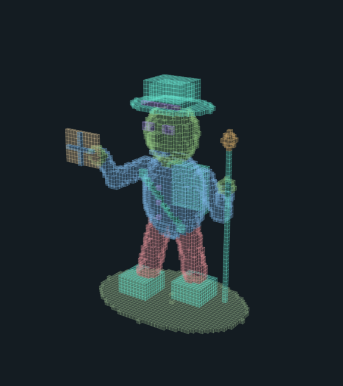
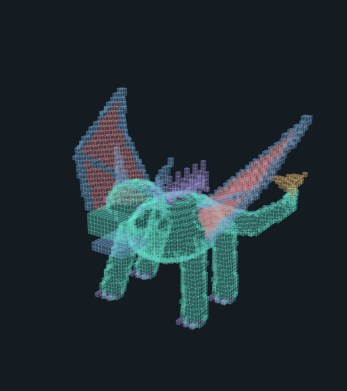
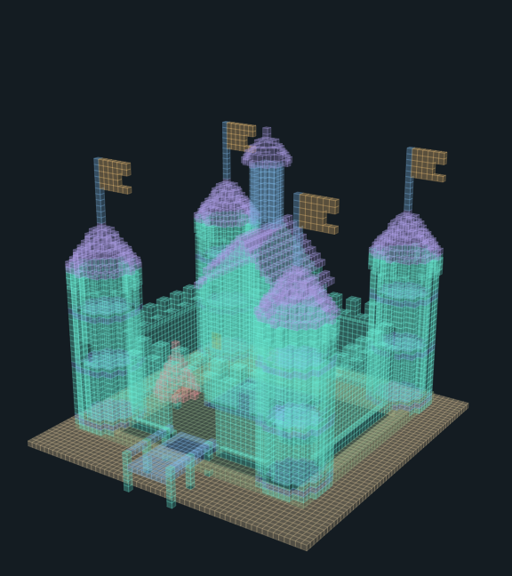
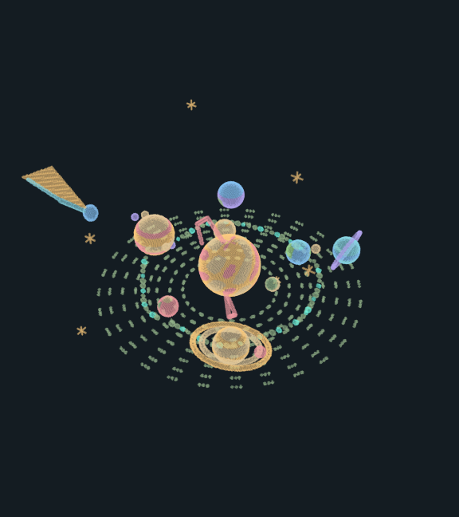
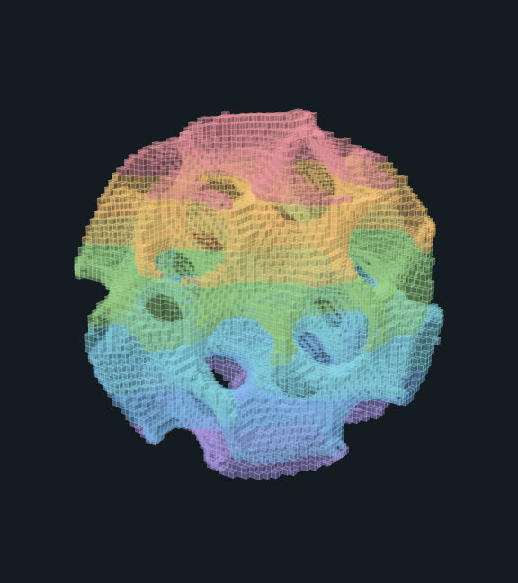
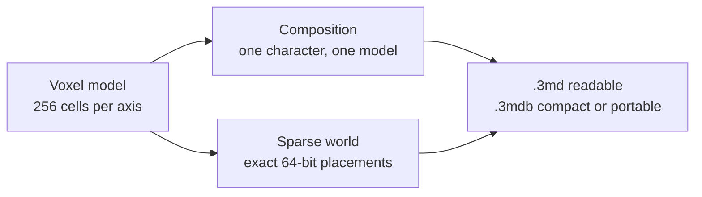

# Sculpt.3md

Sculpt.3md is a native Mac app for a 3D volume you can paint as translucent cubes or ASCII. One window, Settings, and a menu bar. A model stays within 256 cells on each axis and saves as readable `.3md` or compact `.3mdb`. A composition places a whole model with one character. A sparse world places those models at exact 64-bit coordinates and draws the neighborhood in front of the camera.

Sculpt.3md is the product name. These sources live in the 3md repository at `apps/sculpt`. The Swift modules, the executable, and the bundle identifier stay Rook (`labs.corvid.rook`).

This checkout builds against the ThreeMD sources at the repository root, by path. The [distribution checklist](docs/distribution.md) has not been started, and this move does not change Sculpt file formats or cut a Sculpt release. [The docs map](docs/README.md) lists the current pages.

| [Cartographer](Examples/wandering-cartographer.png) | [Dragon](Examples/clockwork-dragon.png) | [Citadel](Examples/citadel-of-arches.png) |
| --- | --- | --- |
| <a href="Examples/wandering-cartographer.png"></a> | <a href="Examples/clockwork-dragon.png"></a> | <a href="Examples/citadel-of-arches.png"></a> |
| [3md](Examples/wandering-cartographer.3md) · [GIF](Examples/wandering-cartographer.gif) · [MP4](Examples/wandering-cartographer.mp4) · [OBJ](Examples/wandering-cartographer.obj) | [3md](Examples/clockwork-dragon.3md) · [GIF](Examples/clockwork-dragon.gif) · [MP4](Examples/clockwork-dragon.mp4) · [OBJ](Examples/clockwork-dragon.obj) | [3md](Examples/citadel-of-arches.3md) · [GIF](Examples/citadel-of-arches.gif) · [MP4](Examples/citadel-of-arches.mp4) · [OBJ](Examples/citadel-of-arches.obj) |

| [Solar system](Examples/grand-solar-system.png) | [Gyroid, 64³](Examples/Math/math-gyroid-64.png) | [Nested courtyard](Examples/Compositions/courtyard.png) |
| --- | --- | --- |
| <a href="Examples/grand-solar-system.png"></a> | <a href="Examples/Math/math-gyroid-64.png"></a> | <a href="Examples/Compositions/courtyard.png"></a> |
| [3md](Examples/grand-solar-system.3md) · [3mdb](Examples/grand-solar-system.3mdb) · [GIF](Examples/grand-solar-system.gif) | [3md](Examples/Math/math-gyroid-64.3md) · [PNG](Examples/Math/math-gyroid-64.png) | [3md](Examples/Compositions/courtyard.3md) · [3mdb](Examples/Compositions/courtyard.3mdb) · [GIF](Examples/Compositions/courtyard.gif) |

The [gallery](Examples/README.md) links every sculpture as 3md, PNG, GIF, MP4 and OBJ. The [math ladder](Examples/Math/README.md) adds formula models from 16³ through 256³. The [1024-cubed case study](docs/volume-1024-case-study.md) puts the byte counts, the probe timings and the offscreen frames on one page, with the `.3md` and `.3mdb` files beside them.



Select a reusable voxel model, edit it with the existing tools, then Apply to all references or Cancel back to the source scene. Make Unique isolates one sparse-world voxel instance. Saving keeps the reference editor's history and selection. [Workflow and bounds](docs/shared-model-editing.md) and [verification](docs/evidence/shared-model-editing/verification-notes.md) describe that landed slice, including its 321-test lane and packaged-app Apply/Cancel, Make Unique, Save and Undo checks.

While a composition or world is open, the File menu offers Insert 3md… (Shift-Command-I) and Insert model folder… (Option-Shift-Command-I); from the main window, the command palette inserts files or a folder into a new composition or world. Local agents can apply the same insertion checks with explicit-file RookTool commands. [Insertion workflow](docs/file-insertion.md) describes placement, refusals and the native fallback.

The current [ThreeMD 2 adoption](docs/3md-2-adoption.md) adds explicit portable text and uncompressed binary copies, content-detected opening and upstream revision-checked shared edits. Existing Sculpt formats and default saves remain. The dependency is the ThreeMD package in this checkout, by path. Copied evidence below records the earlier published 2.0.0 pin. [Original adoption evidence](docs/evidence/3md-2-adoption/verification-notes.md) records 350 passing app tests, 31 harness tests, native copy exports and shared Undo, plus nine Swift/TypeScript/Rust interchange pairings. [Landed PR66 integration](docs/evidence/landed-3md-integration/README.md) records the updated pin and 440 passing tests. Publication and lifecycle closure are tracked separately.

Reusable models can build larger scenes. **File → New composition** opens a visual map where one character places an entire model, including nested maps. **File → New sparse world** places shared models at exact 64-bit coordinates without a fixed cube boundary or storage for the empty gaps. Choose **Whole World** for an overview, **Explore** for WASD and drag-to-look, or **Visit** to reach a landmark. Render distance controls the neighborhood; nearby models use full geometry and farther ones use colored simplified terrain. Bounds remain available for empty models or exhausted geometry budgets. Each editable model stays bounded at 256 cells per axis, with finite file, instance and rendering capacities. [Exploration controls](docs/world-exploration.md) and [nested examples](Examples/Compositions/README.md).

[Composition and world verification](docs/evidence/composition/verification-notes.md) records the final 252-test suite, native save/reopen, selectable proxies and trillion-cell placements. Whole-world flattening and mesh/movie export remain outside this prototype; opening one model creates an editable voxel copy.

**[Blockhaven](Examples/Blockhaven/README.md)** is an original landscape with a village, castle, forests, river and caves, assembled from reusable 32 × 64 × 32 chunks. Open its composition or sparse world to arrange models, or its expanded 192 × 64 × 192 voxel copy to paint. The example set supplies reference sources, compact voxels, PNG, GIF, MP4, and OBJ separately from the existing gallery. The [verification record](docs/evidence/blockhaven/verification-notes.md) includes the complete 287-test lane, native painting and selection checks, and measured large-map optimizations.

**[Math ladder](Examples/Math/README.md)** generates models from formulas at 16, 32, 64, 128 and 256 cells per axis. Every example, including compositions and worlds, appears in one **Examples** gallery with its size; opening one shows its loading progress and can be cancelled.

The window title and menu bar extra are Sculpt.3md. The menu bar offers Show Sculpt.3md, Settings, and Quit Sculpt.3md. Closing the window and choosing Show Sculpt.3md brings back that same window. Settings stores appearance only, under `rook.appearance`: system, light, or dark. `CFBundleIdentifier` remains `labs.corvid.rook`.

Ordinary use stays on this Mac. It does not need an account, a wallet, or a network. Save, open, and export use a file the person chooses. The app does not host agents or services and does not ship bundled fonts or images. A separate development CLI supports structured editing of explicitly supplied files. Readable decoding checks a private 100,000-physical-line limit before ThreeMD parsing; compact decoding validates the header, bounded voxel stream, and checksum.

The editor starts with the hollow orb in Cubes view. Drag to orbit, or enable Paint to add on a cube face or an empty selected slice. Draw adds one cube, Erase removes one, and Fill changes the connected material on the clicked slice. A drag is one undo step; its starting scene, camera, and empty-square geometry stay fixed so added cubes do not move later events into another depth slice. Switch to ASCII to see the same volume as characters, or Slice for direct grid editing. The grid offers Fit, 2×, 4×, 8×, and 16× zoom with scrolling.

Live cubes use a cached, batched SceneKit Metal mesh. Orbit and zoom update the camera without rescanning voxels or rerasterizing the preview; opacity changes materials. The live scene allows up to 500,000 exterior faces with a separate selected-slice mesh of up to 65,536 empty squares. CPU bitmap fallback and PNG/GIF/MP4 exports retain their 250,000 camera-visible-quad bound, and OBJ retains its separate 250,000 exterior-face bound. A refused cube scene leaves Slice and ASCII available. The [camera repair verification](docs/evidence/camera-performance/verification-notes.md) records all 195 tests, the 31-test harness, hi, strict SpecSync, native painting/Undo, and qualified optimized timings: a 9.225 ms median offscreen GPU frame with one mesh installation. This is not an on-screen FPS guarantee.

PNG, GIF, and MP4 use the chosen render style and cube opacity. ASCII text remains a character projection, and OBJ exports occupied-cell surfaces. [Examples](Examples/README.md) links five formats for each of twenty-one examples: 105 artifacts. `RookTool examples` writes those files plus `manifest.json`, preserving cached unchanged originals. The original twelve use ASCII images and animation; eight detailed 64-cubed scenes and the 256-cubed solar system use cubes. The standard turntable is 4 seconds, 10 frames per second, and 576 by 648 pixels. Previous verification is retained for the [gallery and exports](docs/evidence/sculpture-enhancements/verification-notes.md) and the [editor redesign](docs/evidence/editor-redesign/verification-notes.md); those receipts predate the larger cube editor.

[Cube and native pointer checks](docs/evidence/voxel-worlds/verification-notes.md) cover face drawing, stroke undo, erasing, orbit, large models in both styles, and native saving in all five formats. The final seven-step lane passed 143 tests, the 29-test harness, hi, strict SpecSync, source boundaries and release fixtures. Receipts and 24 layout captures are retained alongside the initial pointer failure and its repair.

**Grand solar system** adds the Sun and all eight planets, Saturn's rings, Earth and Jupiter moons, asteroids, a comet, and stars in one editable 256-cubed volume. Sizes and distances are artistically compressed to show the whole scene. Open it from Examples under Space, then orbit or paint it in Cubes or edit its ASCII slices. [Solar-system verification](docs/evidence/solar-system/verification-notes.md) records its 157-test lane, 32 native layout captures, actual painting at cell 255,255,255, and a completed 16.9 MB native 3md save/reopen. The preceding receipts cover the earlier twenty-example revision.

Save and Cmd-S prepare a compact `.3mdb` from an immutable sculpture snapshot away from the main actor. File → Save readable 3md… or Cmd-Shift-S retains the existing text schema; the command palette offers both choices. Open detects either format from its content. A successful save marks only the written snapshot as saved, so later edits remain unsaved. Canceling preparation or the save panel, or a failed save, leaves the saved baseline unchanged. Compact storage is this app's native LZFSE-compressed voxel container with a SHA256 checksum, not an upstream ThreeMD binary standard. [Compact-storage verification](docs/evidence/compact-storage/verification-notes.md) records 177 passing tests, native saves and reopen in both formats, and optimized measurements: the solar system shrinks from 16.9 MB to 60.3 KB and codec decoding drops from 444 ms to 19 ms. Compression takes about 83 ms; file I/O and rendering are excluded from those measurements.

## Development

The [1024-cubed case study](docs/volume-1024-case-study.md) compares a literal 1 GiB dense development buffer with supported reusable worlds. Its large probe is explicit and requires a release build. It measures storage, full decode verification, process memory and qualified offscreen Metal rendering; individual editable models remain 256 cells per axis.

Use Sculpt for the full 3D canvas and Slice for character editing. Cmd-1/2 switch views; Cmd-K finds editor actions. Cmd-N/O/S create, open, and save through the native File menu. The editor's File menu also offers new 16-, 32-, 64-, 128-, or 256-cubed volumes, opening ready to paint. Drawing tools and camera controls appear in their working context. In Slice mode, arrow keys select a cell and Space applies the current tool after switching views or running a command. Exterior-surface extraction and bitmap previews run away from the main actor; obsolete work is canceled. Live camera changes reuse installed geometry. Local agents can [inspect and edit chosen sculpture files with structured commands](Examples/agent-commands.md); readable and compact inputs are bounded at 20 MiB and command JSON at 256 KiB. Apply chooses its output format from a case-insensitive `.3md` or `.3mdb` extension, refusing other extensions and existing destinations. The interface creates a new output file and does not control the running app.

```sh
/opt/homebrew/bin/fledge lanes run verify
/usr/bin/swift run --quiet RookTool package
```

Use `/opt/homebrew/bin/fledge` 1.7.2. `dist/Rook.app` is an ad-hoc bundle for this Mac. Packaging builds `Rook` with `--configuration release` and copies `.build/release/Rook` plus `Info.plist`, with no resources or debug fallback. A failed release build leaves the existing bundle unchanged. Ad-hoc signing, strict verification, entitlement display, and staged replacement remain required.

`hi` 0.8.0 and `specsync` 6.0.0 stay pinned. `hi check` and `specsync check --strict` do not run the product tests. Development targets are `RookTool`, `RookTooling`, and `RookVerification`. Product targets are `RookApp`, `RookCore`, `RookSculpture`, and `RookRendering`. The app links Core and the two sculpture modules. RookSculpture links the ThreeMD product from the package at the repository root, and uses Apple's Compression and CryptoKit frameworks for native compact storage. RookTool also links RookSculpture and RookRendering for fixture generation. The app does not link the development targets.

## Docs

Compositions let one map character place an entire reusable model, including nested model maps. File → New composition opens the visual tile editor; Save composition preserves its shared library, while Open editable voxels explicitly creates a detached sculpture for painting/export. The app-specific readable schema remains self-contained and never opens referenced paths. [Composition workflow and bounds](docs/composable-3md.md) explain the format and the nested courtyard example.

Linked compositions keep their models in separate files. Opening one asks for its project folder, resolves the shared models from those files and shows them read-only, with Reload Linked Files after edits elsewhere. Links that are missing, circular, unsupported or too large are refused naming the file. Self-contained bundles open without the folder. [Linked compositions](docs/linked-composition.md) describes the format, limits and what comes next.

[The docs map](docs/README.md) lists every current product, scene, hold, example, and evidence page.

- [Intent](INTENT.md)
- [Docs map](docs/README.md)
- [Distribution hold](docs/distribution.md)
- [Gallery](Examples/README.md)
- [1024-cubed case study](docs/volume-1024-case-study.md)
- [Architecture](docs/architecture.md)
- [Window](specs/RookApp/RookApp.spec.md)
- [Volume](specs/RookSculpture/RookSculpture.spec.md)
- [Preview](specs/RookRendering/RookRendering.spec.md)
- [Appearance](specs/RookCore/RookCore.spec.md)
