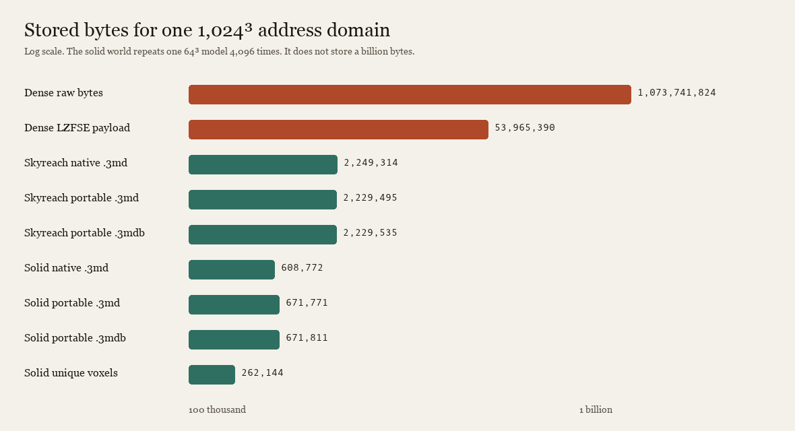
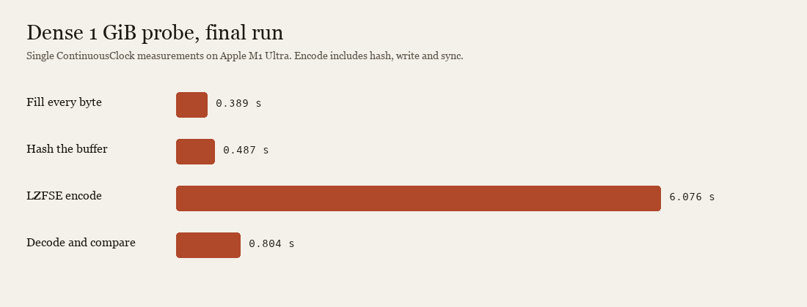
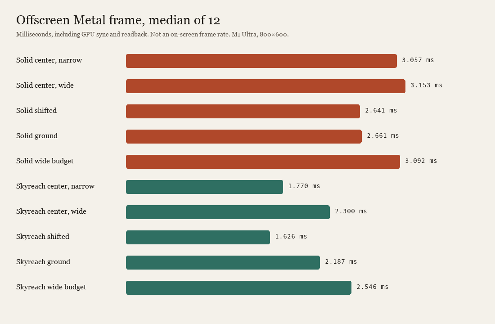
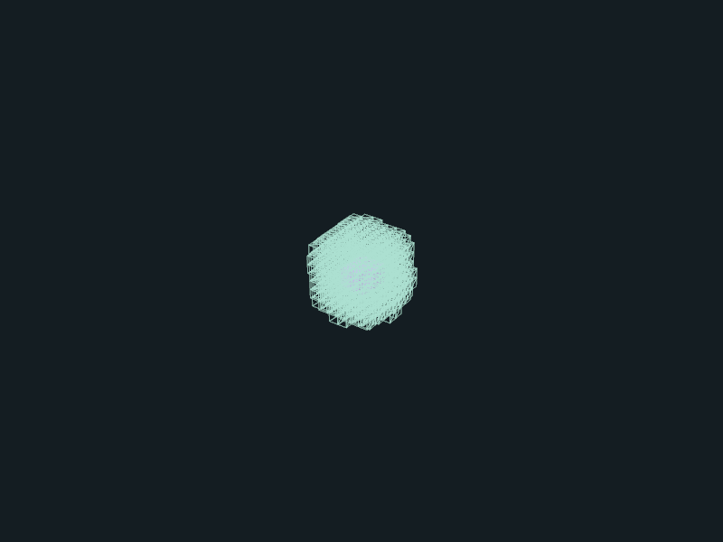
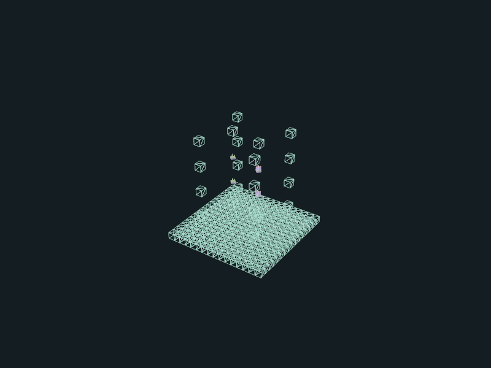
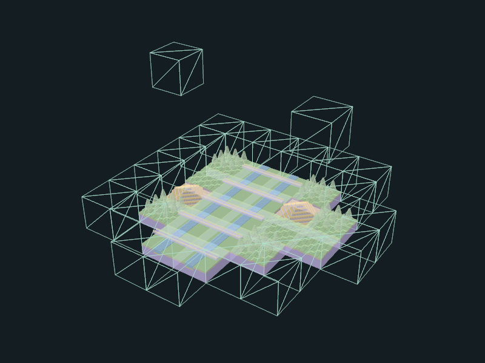

# 1024-cubed case study

A 1,024 × 1,024 × 1,024 address domain holds 1,073,741,824 cells. This page shows what that costs to store, how long the literal 1 GiB probe took, and the offscreen frames of the two reusable worlds. The receipts, hashes and files below are the retained run on Apple M1 Ultra, macOS 26.5.2, source `619a0efc2fd41b51e02daacbce4e7404546fd8d9`.



The dense probe touches every byte. The worlds do not. The solid world repeats one 64³ model 4,096 times, so 1,073,741,824 occupied cells sit in 262,144 unique voxel bytes and a 608,772-byte native file.

## Files

Each world is saved three ways. Native `.3md` is the app's readable `ascii-world-1` document. Portable `.3md` is a ThreeMD text composition. Portable `.3mdb` is the same composition in an uncompressed binary envelope, 40 bytes larger than the text. Open any of them in Sculpt.3md.

| World | File | Bytes | SHA-256 |
| --- | --- | ---: | --- |
| Solid | [solid-1024.3md](evidence/volume-1024/worlds/solid-1024.3md) | 608,772 | `d4b4eb4a4da94a582f0c39d8ef58e85ac78bd11d12fcd554fd1d16364a1bb11d` |
| Solid | [solid-1024.portable.3md](evidence/volume-1024/worlds/solid-1024.portable.3md) | 671,771 | `286ebcc4f1d17b19039300618a0601ea0d38521af2d8d8b6b03f7edd4e4a6ee7` |
| Solid | [solid-1024.portable.3mdb](evidence/volume-1024/worlds/solid-1024.portable.3mdb) | 671,811 | `dd7469dd051b886461c094d4a35eaeb11f40cc17a5ae4de9fd69c9a8baae401a` |
| Skyreach | [landscape-1024.3md](evidence/volume-1024/worlds/landscape-1024.3md) | 2,249,314 | `753a593c8557c313225e078cc29513590958b8d8716c4f5c24150acd21b2552a` |
| Skyreach | [landscape-1024.portable.3md](evidence/volume-1024/worlds/landscape-1024.portable.3md) | 2,229,495 | `d4a581795924ceeb7601307ac760896c804cd893a4ea729395f3d35b770e33bc` |
| Skyreach | [landscape-1024.portable.3mdb](evidence/volume-1024/worlds/landscape-1024.portable.3mdb) | 2,229,535 | `6ac5682862ebccb2720bfb8f97d2e76803675395ca84d2593c9e407c45176595` |
| Skyreach, native save | [landscape-native-save.3md](evidence/volume-1024/native/landscape-native-save.3md) | 2,249,314 | `753a593c8557c313225e078cc29513590958b8d8716c4f5c24150acd21b2552a` |

The native save is byte-identical to `landscape-1024.3md`. Counts and single-run encode times are in [worlds.json](evidence/volume-1024/worlds/worlds.json).

| World | Placements | Library models | Unique voxel bytes | Occupied cells | Native encode | Native decode |
| --- | ---: | ---: | ---: | ---: | ---: | ---: |
| Solid | 4,096 | 2 | 262,144 | 1,073,741,824 | 10.9 ms | 80.0 ms |
| Skyreach | 280 | 9 | 2,097,152 | 28,057,022 | 16.3 ms | 251.6 ms |

Skyreach's occupied cells are the cells that contain material. Its address domain is still the full 1,024³ cube. Editable models stay at 256 cells per axis. These files stay under the 20 MiB native limit and the 16 MiB portable-definition limit.

## Dense probe

The dense command allocates one buffer of 1,073,741,824 bytes, writes every byte, hashes it, streams Apple LZFSE, then decodes and compares every byte. The compressed payload is raw benchmark data. It is not a `.3md` or `.3mdb`, and it is not in the repository. Both the initial run and the final run produced the same 53,965,390-byte payload and the same hashes.



| Check | Final run |
| --- | --- |
| Initialized, raw and decoded bytes | 1,073,741,824 each |
| Compressed bytes | 53,965,390 |
| Raw and decoded SHA-256 | `a769f4f6b088a7d13bd9228fba8d9c7dbbf7e1c42e2b19a808a1a3871b98a82a` |
| Compressed SHA-256 | `e37ef0a7618d02f1fdf952cf30397957b8c3752bf53b09d4fb47eac88e86f183` |
| Encode | 6.076 s |
| Decode and full compare | 0.804 s |
| Physical footprint added by decode | 3,768,344 bytes |

The first decode grew the process by 56,541,232 bytes. The final decoder uses one 1 MiB read buffer and one 1 MiB write buffer. [Both receipts](evidence/volume-1024/dense-analysis.md) keep the phase times.

## Offscreen frames

Ten cases, 120 camera submissions and 12 synchronized frames each, at 800 × 600. The picture under each name is sample 0. Sample 3 is the second link. Median time includes SceneKit flush, GPU synchronization and readback.



| Case | Detail | Proxy | Omitted | Distance culled | Median frame | Sample 0 | Sample 3 |
| --- | ---: | ---: | ---: | ---: | ---: | --- | --- |
| Solid, center, narrow | 20 | 188 | 0 | 3,888 | 3.057 ms | [frame](evidence/volume-1024/metal/dense-equivalent-center-narrow-frame-0.png) | [frame](evidence/volume-1024/metal/dense-equivalent-center-narrow-frame-3.png) |
| Solid, center, wide | 20 | 492 | 3,584 | 0 | 3.153 ms | [frame](evidence/volume-1024/metal/dense-equivalent-center-wide-frame-0.png) | [frame](evidence/volume-1024/metal/dense-equivalent-center-wide-frame-3.png) |
| Solid, shifted | 20 | 124 | 0 | 3,952 | 2.641 ms | [frame](evidence/volume-1024/metal/dense-equivalent-shifted-narrow-frame-0.png) | [frame](evidence/volume-1024/metal/dense-equivalent-shifted-narrow-frame-3.png) |
| Solid, ground | 20 | 119 | 0 | 3,957 | 2.661 ms | [frame](evidence/volume-1024/metal/dense-equivalent-ground-narrow-frame-0.png) | [frame](evidence/volume-1024/metal/dense-equivalent-ground-narrow-frame-3.png) |
| Solid, wide budget | 20 | 492 | 3,584 | 0 | 3.092 ms | [frame](evidence/volume-1024/metal/dense-equivalent-wide-detail-budget-frame-0.png) | [frame](evidence/volume-1024/metal/dense-equivalent-wide-detail-budget-frame-3.png) |
| Skyreach, center, narrow | 1 | 1 | 0 | 278 | 1.770 ms | [frame](evidence/volume-1024/metal/landscape-center-narrow-frame-0.png) | [frame](evidence/volume-1024/metal/landscape-center-narrow-frame-3.png) |
| Skyreach, center, wide | 4 | 276 | 0 | 0 | 2.300 ms | [frame](evidence/volume-1024/metal/landscape-center-wide-frame-0.png) | [frame](evidence/volume-1024/metal/landscape-center-wide-frame-3.png) |
| Skyreach, shifted | 1 | 0 | 0 | 279 | 1.626 ms | [frame](evidence/volume-1024/metal/landscape-shifted-narrow-frame-0.png) | [frame](evidence/volume-1024/metal/landscape-shifted-narrow-frame-3.png) |
| Skyreach, ground | 20 | 22 | 0 | 238 | 2.187 ms | [frame](evidence/volume-1024/metal/landscape-ground-narrow-frame-0.png) | [frame](evidence/volume-1024/metal/landscape-ground-narrow-frame-3.png) |
| Skyreach, wide budget | 33 | 247 | 0 | 0 | 2.546 ms | [frame](evidence/volume-1024/metal/landscape-wide-detail-budget-frame-0.png) | [frame](evidence/volume-1024/metal/landscape-wide-detail-budget-frame-3.png) |

Solid center, wide. Twenty chunks in detail, 492 wireframe proxies, 3,584 placements omitted by the instance budget.



Skyreach center, wide. Four chunks in detail and 276 proxies across the valley and the islands above it.



Skyreach from the ground, narrow distance. Twenty detailed chunks and 22 proxies.



The solid mesh is one shared 24,576-face model. Skyreach prepares 146,918 faces across eight leaves and reuses them. Visible instances stay at or below 512. The wide solid cases omit 3,584 placements. The wide Skyreach case draws 247 proxies because of the face budget. Camera submission medians sit between 0.0047 ms and 0.0051 ms and are separate from the frame times above.

This study kept still PNG frames, two per case. It did not keep a GIF or MP4. The native open of `landscape-1024.portable.3mdb` showed the title `Skyreach 1024-cubed landscape` and 280 placements, then orbit and a save. That walkthrough did not keep its own screenshot. [The observation notes](evidence/volume-1024/native/observations.md) record the focus counts.

## Run it again

```sh
/usr/bin/swift build --configuration release --product RookTool
.build/release/RookTool volume-worlds --output /absolute/new-world-directory
.build/release/RookTool volume-study --output /absolute/new-dense-directory --dense-1024
```

Both destinations must be new entries under existing parents. Ordinary tests do not allocate 1 GiB. The dense command refuses a debug build and checks free memory before the allocation. That snapshot does not reserve the memory.

Opt-in frames:

```sh
ROOK_VOLUME_STUDY_RENDERING=1 \
  /usr/bin/swift test --configuration release --no-parallel \
  --filter SculptureVolumeStudyRenderingTests
```

The full evidence index, including the 144 cross-language transfers and the 371-test lane, stays in [volume evidence](evidence/volume-1024). Compression of this repeated pattern is not a prediction for other models. These frame times are not an on-screen frame rate, and the renderer does not draw a billion individual cubes.
