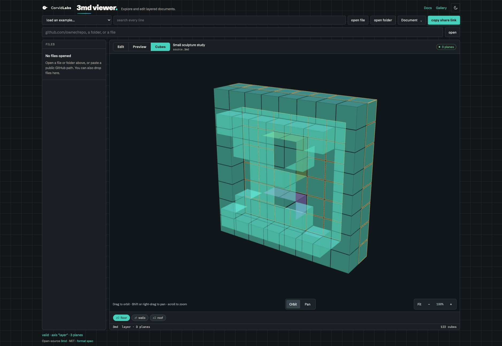
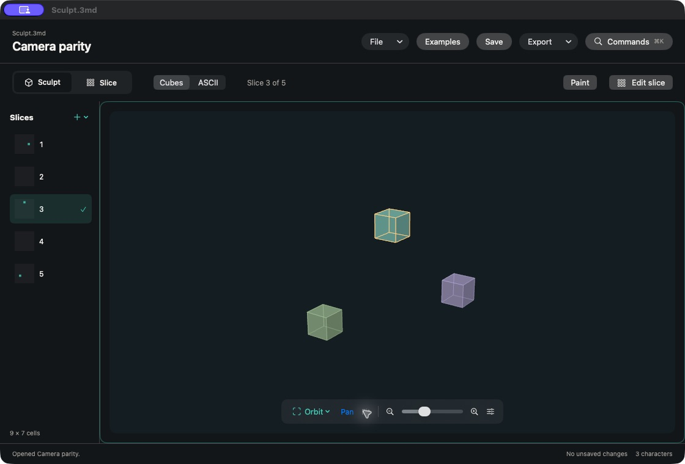

# Sculpt and viewer camera parity

Leif approved full camera parity and verified closure on 2026-10-10. This change supplies full yaw and pitch turns with a continuous basis through both poles, screen-space pan, proportional zoom from 0.5 to 2, and Fit at the same default pose. Native yaw is the negative of browser yaw. The new axis sphere and numeric movement controls are a separately defined draft and are not implemented here.

The shared asymmetric scene is `camera-parity.3md`. `camera-parity.json` contains independent double-precision bases and expected screen coordinates for front, default, top, past-top, bottom, upside-down and panned poses at 400 by 320. Browser tests inspect the actual GPU matrix and pick each projected cell; native tests check the live matrix against the same numbers and compare CPU/live picking. Orbit, pan and selection retain installed geometry.

Interactive native cameras opt into complete-volume framing with `fitsVolume`. Default utility cameras retain the established scale, preserving the five committed math example PNGs. The flag stays in session state, follows the camera into CPU/ASCII/GPU and current-view exports, and is not persisted in documents. No example fixtures, formats, parsers, bundles or versions changed.

## Current verification

- macOS Chromium/WebKit viewer: 106 passed.
- Current Linux Chromium/WebKit projection and phone checks: 4 passed. The full Linux run is pending; the prior run loaded the earlier fixture and found a phone spacing issue, both corrected and rechecked.
- Native camera, live projection/picking, pointer input and math example regression selection: 23 tests in four suites passed.
- Full native suite using the existing CI selection (`--no-parallel --skip deterministicPortableInterchangeFixtures`): pending. The prior run found five preview differences, now resolved by preserving default utility framing. An earlier unconstrained parallel run also showed AppKit focus interference. No new skips were introduced.
- Root strict SpecSync: four specs passed with zero warnings and 55/55 source files covered. Native strict SpecSync: five specs passed with zero warnings and 94/94 files covered.
- Root Hi: 85 criteria passed. Native Hi: 48 criteria passed.
- Current pinned Trust and lifecycle closure: pending. Scope approval is not human diff review, independent review or signed provenance.

## Live inspection

The browser was refreshed against the working checkout. The native preview opened the same 9 by 7 by 5 scene, panned the three cubes and restored Fit while preserving slice 3, three characters and the no-unsaved-changes status. The native screenshot comes from the isolated agent preview, without replacing the installed app. These are agent observations.

